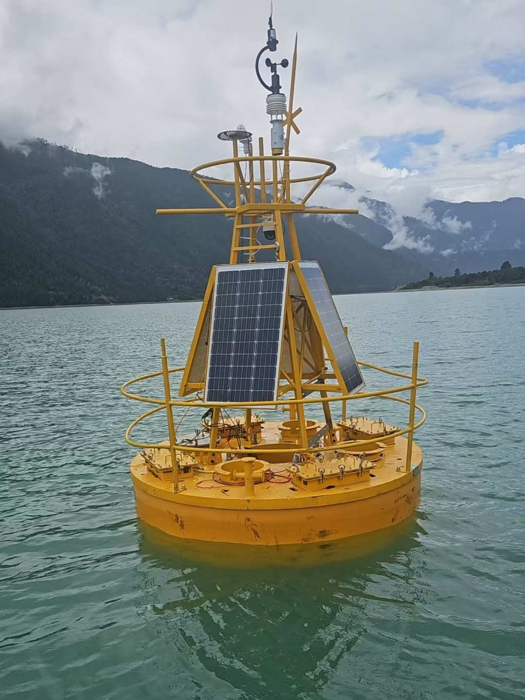
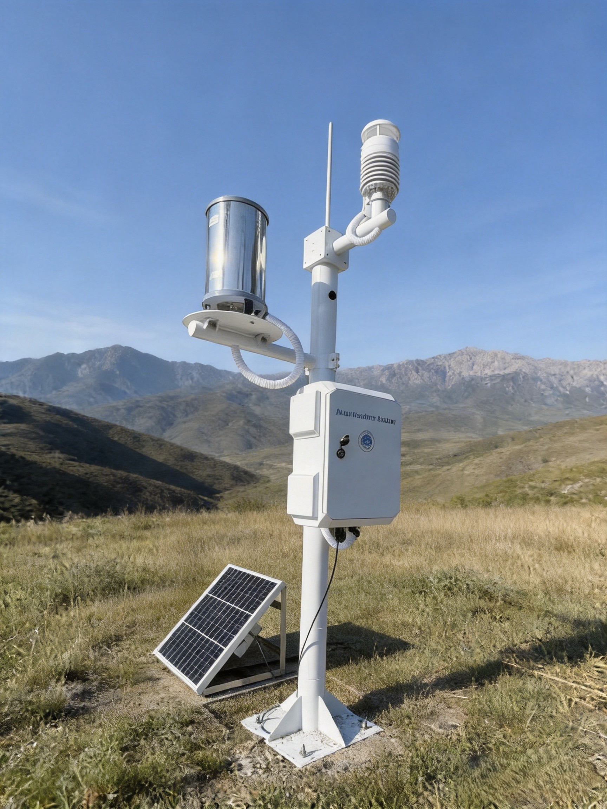
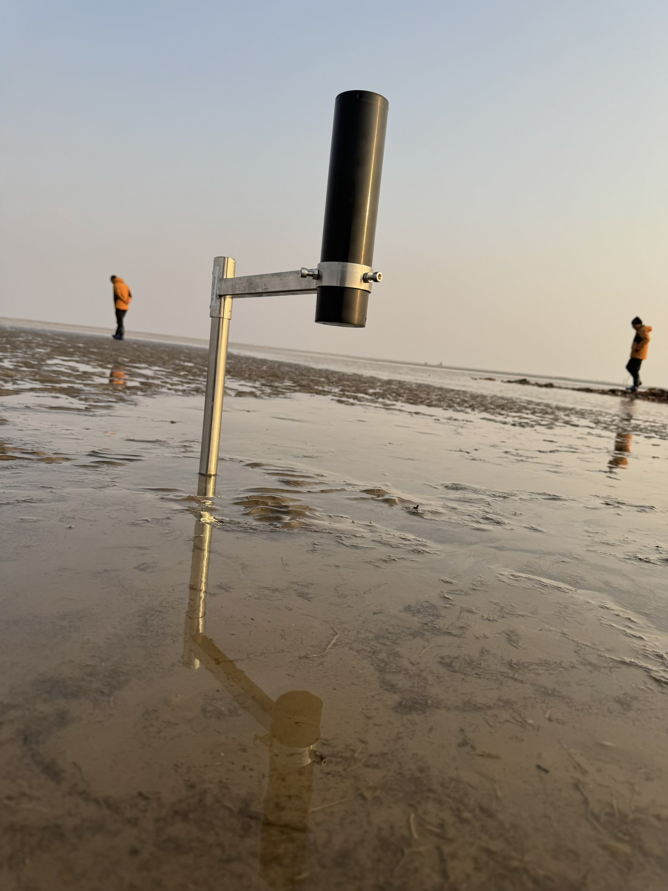

+++
title = "关于 | MOJOY LINK 沐玥智联"
description = "沐玥智联专注水质、气象环境监测系统配套服务，提供监测设备供应、项目落地、全周期运维一体化解决方案"
date = "2026-06-21T17:25:43+08:00"
draft = false
tags = [ "企业介绍" ]
categories = [ "企业信息" ]
series = [ ]
showHero = true
heroStyle = "background"
showRelatedContent = false
showPagination = false
+++

<!-- 图片选用：水环境气象监测 蓝色科技矢量背景 -->

## 企业概述
沐玥智联科技扎根青岛，聚焦水环境、大气气象两大环境监测核心赛道，面向国内高校、科研院所、生态环境主管单位、生产企业、产业园区提供专业化配套服务。
业务覆盖水质监测仪器、气象采集终端、海洋浮标系统、自动取样设备、数据采集器等全系列设备供货，同时承接监测项目整体实施、野外站点搭建、设备长期运维托管等配套服务。

公司依托成熟行业供应链资源与多年一线科研项目落地实操经验，深耕科研场景监测需求，针对课题申报、野外观测、长期定点监测等差异化场景提供定制化成套解决方案，兼顾方案合规性、设备稳定性与项目落地性价比。
<!-- 图片选用：野外监测设备作业简约插画 / 概念图 -->


  
  
  
  <!-- 
  
  
   -->


## 行业积淀与核心优势
团队核心成员深耕环境监测科研配套领域多年，全程深度参与多类国家级、省级科研监测项目全流程落地，拥有完整的项目方案设计、设备选型统筹、现场实施调试、后期运维管理实操经验。

多年服务周期内，先后与海洋一所、江苏省海洋厅、西藏大学等多家科研机构与地方环境主管单位达成深度项目合作，充分熟悉科研课题申报规范、野外复杂工况部署要求、项目验收全套标准，能够精准匹配科研场景下各类监测使用需求。

依托长期行业深耕积累，公司搭建稳定完善的上游设备供应链体系，同时联动高校技术团队、专业配套生产机构形成成熟协同服务体系，可灵活适配大中小型科研监测项目需求，兼顾交付效率与方案专业性。
从前期需求对接、设备选型配套，到中期现场施工安装、数据联调，再到后期年度巡检、设备校准、故障维护，可提供一站式闭环服务，为合作单位省去多方对接的繁琐流程。

<!-- 图片选用：科研方案设计、系统拓扑示意图 -->


## 核心业务板块
### 一、环境监测设备成套供应
1. 水质监测系列：多参数水质传感器、在线监测终端、自动取样机械设备；
2. 气象监测系列：一体化气象站、温湿度、气压、降水多要素采集设备；
3. 海洋浮标监测系统：近海定点浮标、数据传输供电一体化成套设备；
4. 配套采集设备：多通道数据采集器、防护机箱、供电、传输全套辅材配件。

### 二、监测项目整体实施
针对各类纵向科研课题、野外观测专项，提供从方案编制、设备成套供货、野外站点布设、系统联调、验收资料协助整理全流程配套服务，贴合科研项目申报与结题验收标准。

面向工厂、产业园区、排污企业搭建水质/气象在线监测站点，匹配环保监管合规要求，完成设备安装、联网调试、数据对接等一体化施工。

### 三、监测设备全周期运维托管
面向长期观测站点提供常态化服务：定期现场巡检、设备故障检修更换、年度精度校准、传输链路维护、数据稳定性保障等长效托管服务。

## 服务定位
我们以环境监测需求为核心服务方向，专注服务高校、海洋与生态类科研院所、地方生态环境管理单位，深度定制适配化监测方案，所有配套服务与设备组合均围绕实际观测场景优化，适配实验室、野外长期定点、近海浮标观测等多元化研究场景。

## 经营理念
### 专业深耕，全域适配
团队多年深耕水质、气象监测传感器，熟悉各类监测传感器选型、野外工况适配、数据采集传输底层逻辑，打造稳定可靠的设备配套方案。
### 资源协同，高性价比
整合上游设备厂商、高校技术团队、专业外协服务资源，构建轻量化高效服务模式，为科研、企业客户控制项目采购与实施综合成本。
### 全程闭环，一站式服务
针对不同场景定制专属成套解决方案，从前期需求沟通到后期长期运维，全程专属技术对接，简化合作单位项目管理工作。
### 长效运维，长久共赢
坚持务实经营思路，以设备稳定、实施可靠、长效售后为核心，与科研机构、生产企业建立长期可持续合作关系。

  浏览监测设备
  商务&技术咨询

