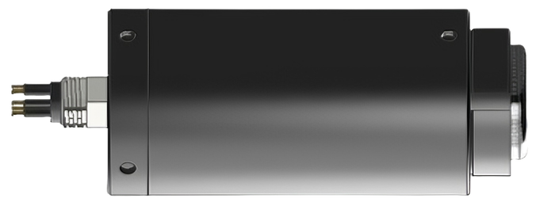

+++
title = "H-BATH-ECH100 回声测深仪"
description = "H-BATH-ECH100 在线版回声测深仪采用450kHz声频，5°锥形波束，量程0.15-100m，分辨率1mm，RS485输出，自容式工作模式，内置温度传感器，支持Micro SD卡存储，用于江河湖泊水库海洋水深测量。"
summary = "H-BATH-ECH100 回声测深仪集成高精度声学测深与温度传感，支持自容式长期观测，RS485数字输出，配套GUI软件，适用于水文调查、航道测量、水库测深等场景。"
date = "2026-07-31T10:00:00+08:00"
draft = false
tags = [ "水文仪器设备" ]
keywords = [
  "H-BATH-ECH100",
  "回声测深仪",
  "水深测量仪",
  "在线式测深仪",
  "单波束测深仪",
  "水文测量设备",
  "水深传感器"
]
+++

## 产品简介

H-BATH-ECH100 在线版回声测深仪采用 450kHz 高频声学测深技术，5°锥形波束设计，量程覆盖 0.15m 至 100m，深度分辨率达 1mm。设备集成温度传感器，测量精度 0.5℃，支持自容式长期观测工作模式。

设备采用 RS485 数字输出接口，兼容 ASCII TXT、HYPACK TOPCONRECEIVER、HYDROPRO 等多种数据格式，内置 Micro SD 卡存储（最大支持 32GB），磁开关激活，配套 GUI 软件实现数据下载与上传。乙缩醛 PVC 外壳，耐腐蚀设计，最大工作深度 100m，适用于江河、湖泊、水库、海洋等多种水域的水深测量。

## 规格参数

| 参数 | 指标 |
|------|------|
| 声频 | 450 KHz ± 5% |
| 波束宽度 | 5°(-3dB) 锥形波束 |
| 发射脉冲宽度 | 10μs-200μs（以10μs为步长） |
| 量程 | 0.15 m ~ 100m |
| 深度分辨率 | 1 mm |
| 采样频率 | 100kHz |
| 温度分辨率 | 0.1°C |
| 温度精度 | 0.5℃（-10℃ ~ +50℃） |
| 工作模式 | 自容式 |
| 数字输出接口 | RS485 |
| 数据输出格式 | ASCII TXT，HYPACK TOPCONRECEIVER，HYDROPRO及其他自由协议 |
| 数据存储 | Micro SD卡（最大 32GB, SDHC） |
| 激活方式 | 磁开关 |
| 配套软件 | GUI 软件（数据下载上传） |
| 电源 | DC 12V |
| 工作温度 | -10℃ ~ +50℃ |
| 最大工作深度 | 100 m |
| 外壳材质 | 乙缩醛 PVC |

## 适用场景

1. 河流水深断面测量与河道冲淤监测
2. 湖泊水库水下地形测绘与库容测算
3. 港口航道水深测量与通航安全评估
4. 海洋近岸水深调查与海岸带测绘
5. 水利工程水下施工监测与验收测量
6. 内河航道电子江图数据采集
7. 水文站长期水位水深自动监测

  下载产品彩页

