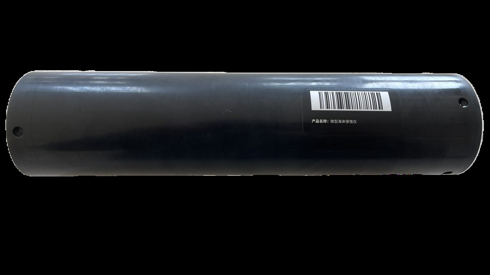

+++
title = "H-BATH-ECH101 回声测深仪（自容式蓝牙款）"
description = "H-BATH-ECH101 自容式回声测深仪采用450kHz声频，5°锥形波束，量程0.15-100m，分辨率1mm，蓝牙通讯，2节D型锂亚电池续航约1年，支持NMEA0183/Binary输出，用于河床海床侵蚀淤积监测、沉积物研究、桥梁冲刷分析、潮汐波高测量。"
summary = "H-BATH-ECH101 自容式回声测深仪集成蓝牙通讯与磁开关控制，完全无电缆独立工作，GUI软件下载上传数据，体积小重量轻，适用于河床侵蚀淤积测量、沉积物研究、桥梁冲刷、潮汐波高监测等场景。"
date = "2026-08-03T10:00:00+08:00"
draft = false
tags = [ "水文仪器设备" ]
keywords = [
  "H-BATH-ECH101",
  "自容式回声测深仪",
  "蓝牙水深仪",
  "河床侵蚀监测",
  "沉积物测深仪",
  "桥梁冲刷测量设备",
  "自记式水深传感器"
]
+++

## 产品简介

H-BATH-ECH101 是一款高精度自容式回声测深仪，采用 450kHz 高频声学测深技术，5° 锥形波束设计，量程覆盖 0.15m 至 100m，深度分辨率达 1mm。设备集成温度传感器，分辨率 0.1℃，精度 ±0.5℃，完全自容式工作方式，无电缆连接，使用方便。

设备支持蓝牙高速数据传输，兼容 Binary、ASCII TXT、NMEA0183 多种数据格式，内置 Micro SD 卡存储（最大支持 32GB），磁开关控制激活，配套 GUI 软件实现数据下载与上传。采用 2 节 D 型锂亚电池供电，续航可达 1 年（记录频率大于 5 分钟/条）。乙缩醛 PVC 外壳，100m 防水深度，紧凑轻便，广泛应用于河床海床侵蚀淤积测量、沉积物研究、桥梁冲刷分析、潮汐监测、波高测量及港口安全监测等场景。

## 规格参数

| 参数 | 指标 |
|------|------|
| 声频 | 450 KHz ± 5% |
| 波束宽度 | 5°(-3dB) 锥形波束 |
| 发射脉冲宽度 | 10μs-200μs（以10μs为步长） |
| 量程 | 0.15 m ~ 100m |
| 深度分辨率 | 1 mm |
| 采样频率 | 100kHz |
| 温度分辨率 | 0.1°C |
| 温度精度 | 0.5℃（-10℃ ~ +50℃） |
| 工作模式 | 自容式 |
| 数字输出接口 | 蓝牙 |
| 数据输出格式 | Binary，ASCII TXT，NMEA0183 |
| 数据存储介质 | Micro SD卡（最大 32GB, SDHC） |
| 激活方式 | 磁开关 |
| 数据下载上传 | 配套 GUI 软件 |
| 电源 | 2节 D 型锂亚电池 |
| 运行时长 | 1年（记录频率大于5分钟一条数据） |
| 工作温度 | -10℃ ~ +50℃ |
| 最大工作深度 | 100 m |
| 外壳材质 | 乙缩醛 PVC（100m） |
| 尺寸 | 直径 70mm × 长 283.5mm |

## 适用场景

1. 河床及海床的侵蚀淤积长期监测（微型海床侵蚀仪）
2. 水下沉积物厚度与分布研究
3. 桥梁墩基础受到冲刷的监测与研究
4. 河口海岸带海床高程变化测量
5. 潮汐水位长期自动监测
6. 近岸波浪高度测量与统计分析
7. 港口航道水深变化与安全监测

  下载产品彩页

