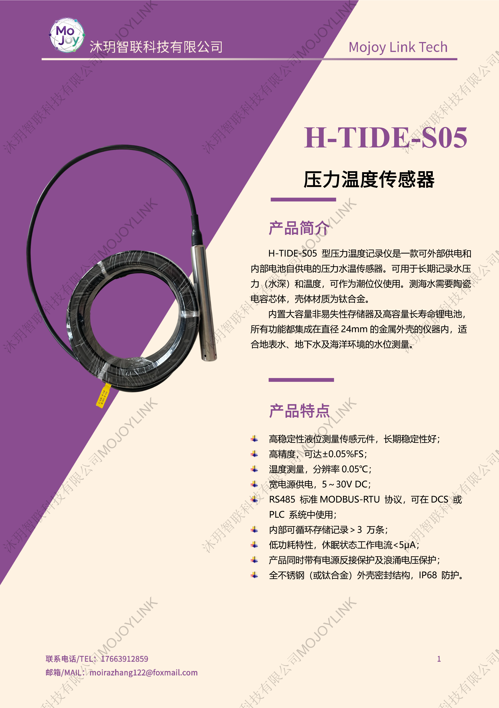
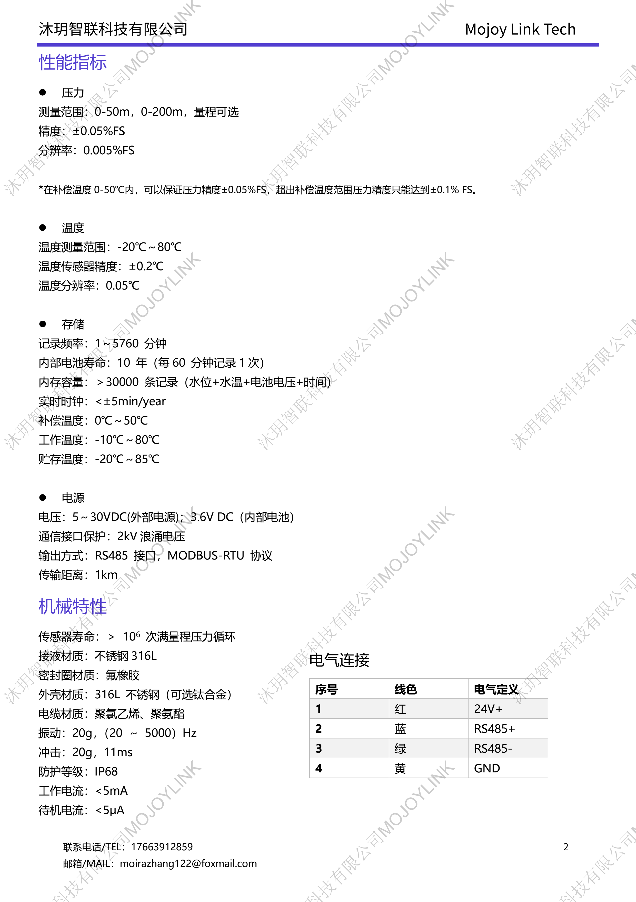

+++
title = "H-TIDE-S05 高精度压力温度传感器"
description = "H-TIDE-S05 水位温度传感器支持电池 / 外接双供电，精度 ±0.05% FS，IP68 钛合金 / 不锈钢外壳，内置大容量存储，Modbus RS485 输出，用于海洋潮位、河湖地下水长期水位水温监测。"
tags = [ "水文仪器设备" ]
summary = "H-TIDE-S05 一体式潮位记录仪集成水深压力与水温检测，超低功耗锂电池续航可达 10 年，可存储 3 万条以上数据，耐腐蚀外壳适配海水淡水，适配浮标、岸站、地下水井定点观测。"
date = "2026-06-30T22:49:59+08:00"
keywords = [
  "H-TIDE-S05",
  "压力温度记录仪",
  "地下水水位监测仪",
  "海水液位探头",
  "潮位传感器",
  "高精度水位计",
  "钛合金水下液位传感器"
]
+++

<!-- 
  
  
  
  
  
  
  
 -->

## 产品简介
H-TIDE-S05 压力温度记录仪是一体化高精度液位水温监测设备，可作为潮位仪长期记录水深压力与水体温度，支持内置锂电池自供电与外部 5~30VDC 双供电模式。设备采用 316L 不锈钢或耐海水钛合金密封壳体，IP68 全防水防护，测量精度最高可达 ±0.05% FS；内置大容量存储可记录超 3 万条水位、水温、电压数据，休眠电流＜5μA，电池单次使用最长可达 10 年，搭载标准 RS485 Modbus 协议，适配各类水下长期无人值守液位观测场景。

## 规格参数

## 适用场景
1. 近海、港湾、潮位站海洋潮汐水位连续监测
2. 河流、湖泊、水库地表水水位水温定点观测
3. 地下水井、岩溶地下水资源长期动态监测
4. 水上浮标、岸基水质监测站配套液位探测
5. 水利水文站、防汛排涝水位预警监测
6. 海洋科研、地质地下水野外长期定点实验
