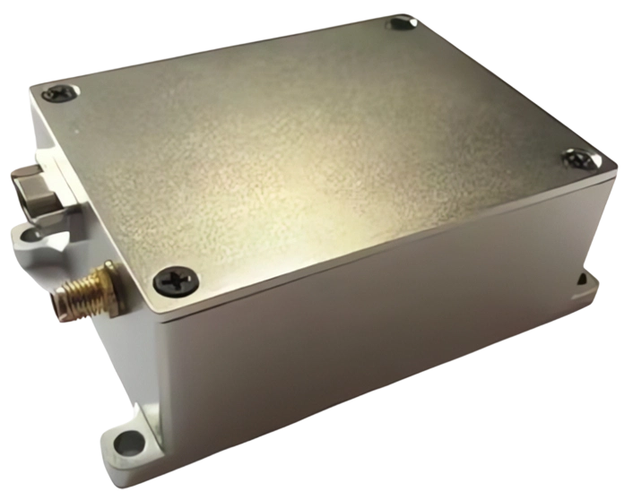

+++
title = "H-WAVE-S30 波浪传感器"
description = "H-WAVE-S30 加速度式波浪传感器测量波高0.2~30m、波周期2~30s、波向0~360°，波高精度±(0.1+5%H)m，波周期±0.3s，波向±10°；DC 12V供电，主频180M时电流<62mA，重量0.3Kg，尺寸120×120×60mm；RS232/RS485/Ethernet三接口，32GB TF卡存储（4Hz采样可连存4个月），支持在线波浪谱计算，FAT文件系统文本存储，耐高温轻量化易集成，为海洋波浪观测研究提供可靠数据。"
summary = "H-WAVE-S30 采用加速度式原理测量波浪，有效获取波高、波周期、波向三要素；全新耐高温材料降低重量，体积小（120×120×60mm）重量轻（0.3Kg），易集成于各类浮标；三接口输出+大容量TF卡+在线波浪谱计算，兼具高精度、高可靠性、低功耗特性，为海洋波浪观测和研究提供可靠数据。"
date = "2026-08-03T10:00:00+08:00"
draft = false
tags = [ "水文仪器设备" ]
keywords = [
  "H-WAVE-S30",
  "波浪传感器",
  "加速度式波高仪",
  "波浪方向测量",
  "海洋波浪观测",
  "浮标集成波浪传感器",
  "波周期波谱在线计算"
]
+++

## 产品简介

H-WAVE-S30 型波浪传感器采用**加速度式原理**测量波浪，可有效获取海洋波浪高度、波浪周期、波浪方向三大核心要素信息。设备采用**全新耐高温材料**封装，在提高产品极端环境适应性的同时大幅降低了产品重量；整机体积小（120×120×60mm）重量轻（0.3Kg），**易集成于多种类型浮标系统**，具备高精度、高可靠性、稳定性好、功耗低的综合特点，为海洋波浪观测和科学研究提供可靠数据支撑。

## 产品特征

- **波高三要素测量**：波高 0.2~30m / 波周期 2~30s / 波向 0°~360°，全面覆盖波浪观测需求
- **高精度与分辨率**：波高精度 ±(0.1+5%H)m，分辨率 0.1m；波周期 ±0.3s（4Hz采样），分辨率 0.1s；波向 ±10°，分辨率 1°
- **低功耗设计**：主频 180M 工作电流 <62mA，主频 72M 工作电流 <42mA，适配电池/太阳能浮标站点
- **三接口灵活输出**：RS232 / RS485 / Ethernet，支持自报式、查询式、兼容式等多种工作模式
- **大容量本地存储**：32GB TF卡（最大支持 128GB），4Hz 连续采样可存储约 4 个月；FAT 文件系统以文本格式存储，离线数据读取方便
- **在线数据处理**：支持在线计算波浪谱，支持在线传输原始数据，直接输出最大波高/有效波高/平均波高/主波向/16方位波向分布等丰富统计量
- **轻量化易集成**：0.3Kg 超轻机身 + 120×120×60mm 紧凑尺寸，适配各类浮标、观测平台集成部署

## 规格参数

| 参数类别 | 指标 |
|----------|------|
| **波高测量** | 量程 0.2m ~ 30m；精度 ±(0.1+5%H)m（H为实测波高）；分辨率 0.1m |
| **波周期测量** | 量程 2s ~ 30s；精度 ±0.3s（4Hz采样默认）/ ±0.5s（2Hz采样）；分辨率 0.1s |
| **波向测量** | 量程 0° ~ 360°；准确度 ±10°（室内标定为准）；分辨率 1° |
| **数据格式说明** | 所有测量结果保留小数点后 1 位，四舍五入 |
| **电气参数** | 电源 DC 12V；主频 180M 工作电流 <62mA，主频 72M 工作电流 <42mA |
| **输出接口** | RS232、RS485、Ethernet（三接口）；J30J 9芯接头（引脚1=12V+、引脚2=GND、引脚3=RS232收、引脚4=RS232发、引脚5=信号地） |
| **存储性能** | 32GB TF 卡（最大支持 128GB）；4Hz 连续采样 ≈ 可存储 4 个月；文本文件存储，FAT 文件系统 |
| **数据处理模式** | 支持在线波浪谱计算、在线传输原始数据；支持自报式 / 查询式 / 兼容式多种工作模式 |
| **输出统计量** | 采集时间年月日时 + 最大波高/最大波周期 + 有效波高/有效波周期 + 1/10波高/1/10波周期 + 平均波高/平均波周期 + 波浪个数 + 主波向 + 实际波向 + 16方位波向分布 |
| **物理参数** | 最大重量 0.3Kg；外形尺寸 120×120×60mm |

## 适用场景

1. **近海台站、航道港口** 波浪长期定点监测（波高/波周期/波向三要素遥测）
2. **各类海洋观测浮标** 集成部署（体积小重量轻，0.3Kg + 120mm 紧凑尺寸）
3. **海洋科学研究**：波浪谱在线计算与长期波浪数据采集，为科研项目提供高质量波浪序列
4. **海洋工程施工、海岸防护** 波浪环境实时监测，为工程作业和防灾预警提供依据
5. **海岛站、海上平台、船舶** 固定式波浪监测（耐高温材料 + 多接口输出灵活组网）
6. **海啸预警、风暴潮监测** 应急响应型波浪观测站点部署

  下载产品彩页

