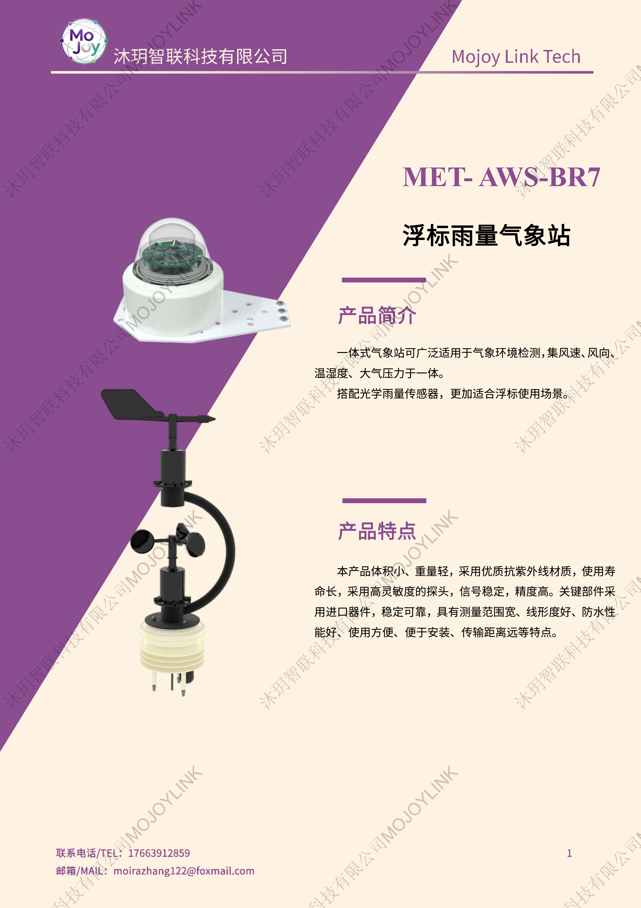
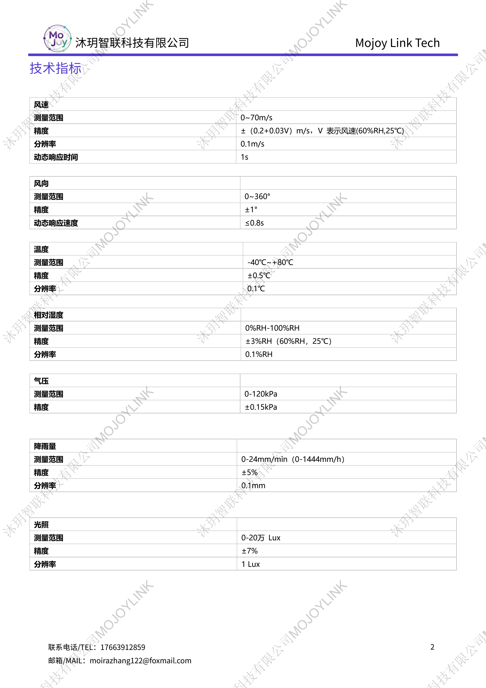
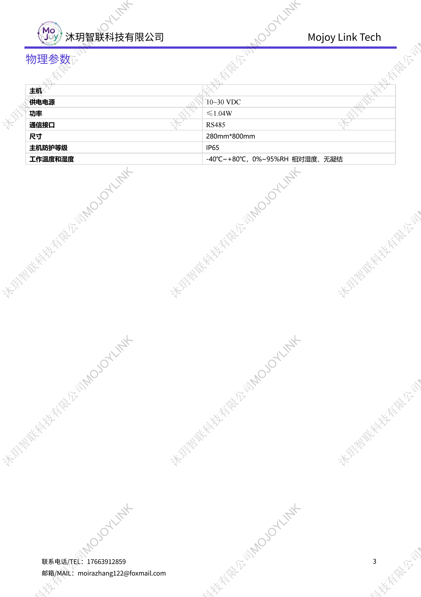

+++
title = "MET-AWS-BR7 浮标雨量气象站"
description = "MET-AWS-BR7 浮标雨量气象站集成风速风向、温湿度、气压、光学雨量、光照传感器，IP65 防水，体积轻便抗 UV，专为湖泊海洋浮标水上环境气象监测设计。"
summary = "MET-AWS-BR7 浮标雨量气象站集成风速风向、温湿度、气压、光学雨量、光照传感器，IP65 防水，体积轻便抗 UV，专为湖泊海洋浮标水上环境气象监测设计。"
date = "2026-06-26T22:06:36+08:00"
draft = false
tags = [ "气象观测设备" ]
keywords = [
  "MET-AWS-BR7 浮标气象站",
  "水上气象站",
  "浮标雨量监测设备",
  "湖泊海洋气象传感器",
  "IP65 水上多要素气象站"
]
+++

## 产品简介
MET-AWS-BR7 是专为水上浮标场景打造的多要素气象监测站，集成风速、风向、空气温湿度、大气压力、光学雨量、光照六大监测模块，区别传统翻斗雨量计，光学雨量结构更适配长期水上浮标使用。

整机采用抗紫外线优质外壳，体积小巧、重量轻便，核心元器件选用进口配件，测量精度高、信号稳定；设备防护等级 IP65，宽电压 10~30VDC 供电，总功耗低，标配 RS485 标准通讯接口，安装简易、远距离数据传输稳定，可长期在高温低温高湿水上环境稳定运行。

## 规格参数

## 适用场景
1. 海洋、近海、湖泊、水库水上浮标气象自动监测
2. 河道、流域水环境配套气象要素同步观测
3. 水上生态、水产养殖区域气象环境监测
4. 海洋科研、湖泊野外水上气象实验
5. 水上风电、码头港口区域气象预警监测

