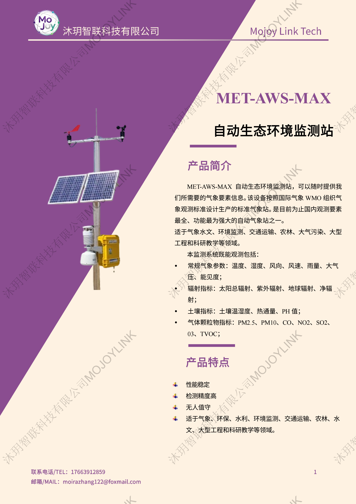
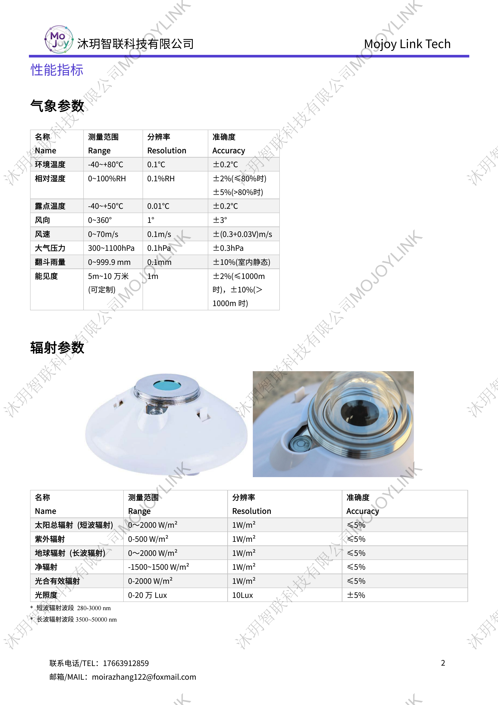
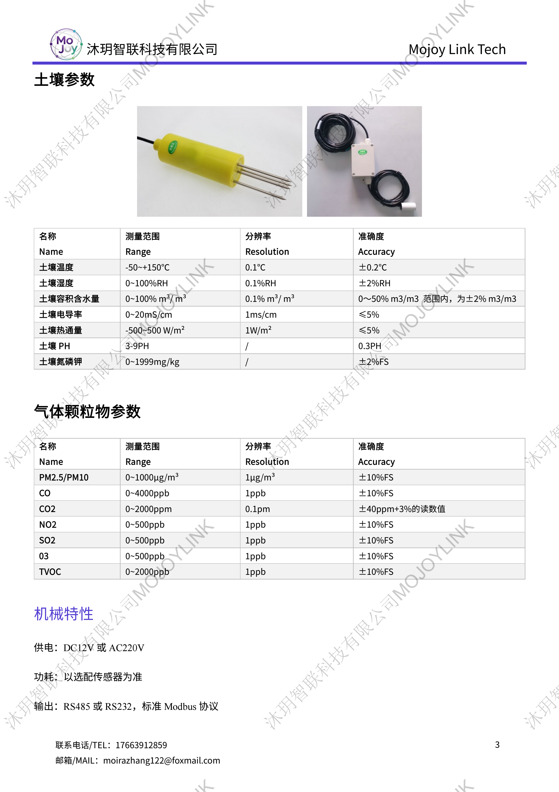
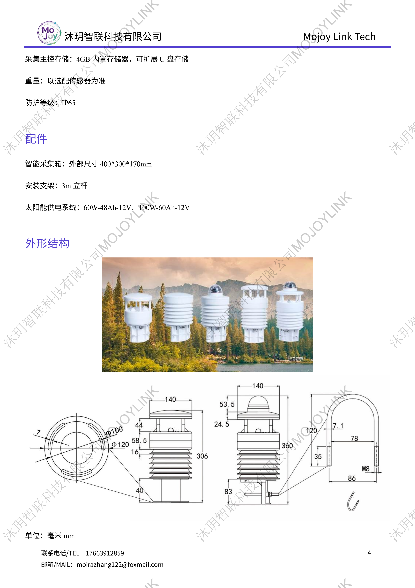

+++
title = "MET-AWS-MAX 全自动生态环境监测站"
description = "MET-AWS-MAX 生态环境监测站遵循 WMO 气象标准，集成气象、辐射、土壤、空气颗粒物气体多类监测模块，IP65 防护，无人值守，适用于环保、农林、科研、工程全域生态观测。"
summary = "MET-AWS-MAX 综合生态监测站要素齐全，可同步采集常规气象、长短波辐射、土壤墒情理化指标、PM2.5 及多种污染气体，支持市电 / 太阳能供电，Modbus 通讯，长期野外自动监测。"
date = "2026-06-27T16:02:14+08:00"
draft = false
tags = [ "气象观测设备", "生态综合监测站" ]
keywords = [
  "MET-AWS-MAX 生态环境监测站",
  "WMO 标准全自动气象站",
  "多要素生态综合监测设备",
  "大气土壤辐射一体化监测站",
  "农林环保科研气象观测站"
]
+++

## 产品简介
MET-AWS-MAX 自动生态环境监测站严格按照国际 WMO 气象观测标准研发，是观测要素覆盖全面的一体化综合监测设备。系统可按需选配四大类监测模块：常规气象、全波段辐射、土壤理化指标、大气颗粒物与污染气体，一站式完成区域生态环境立体化数据采集。

整机防护等级 IP65，支持 DC12V/AC220 双供电，可选配太阳能独立供电方案；搭载大容量本地存储，采用 RS485/RS232 标准 Modbus 协议，设备测量精度高、运行稳定，可实现全年野外无人值守自动观测，配套标准化立杆与采集主控箱，安装部署便捷。

## 规格参数

## 适用场景
1. 气象部门标准地面综合气象观测
2. 生态环境局大气、土壤、流域全域生态监测
3. 农林、果园、农田墒情与小气候长期观测
4. 高校、科研院所生态、大气、辐射相关野外实验
5. 高速、轨道交通交通气象预警监测
6. 矿山、基建、园区大型工程环境监测
7. 大气污染、温室气体区域溯源监测

