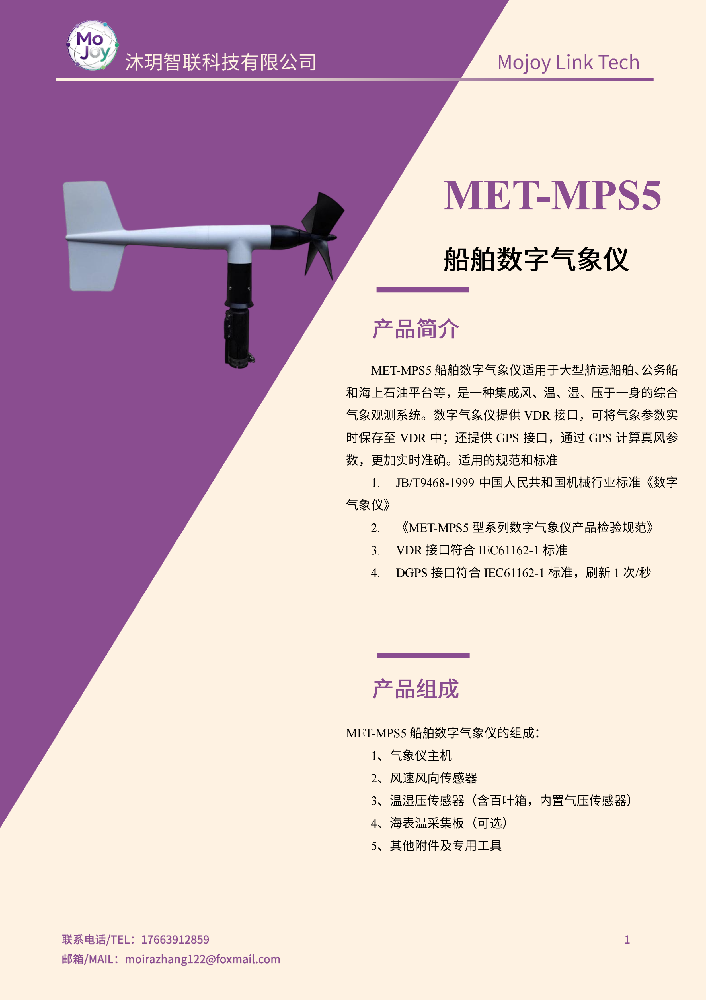
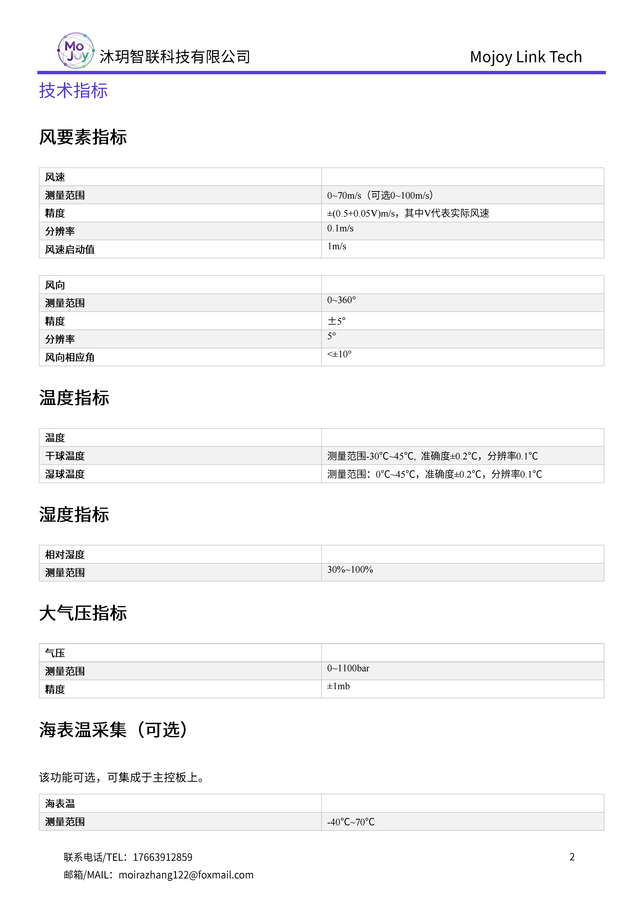
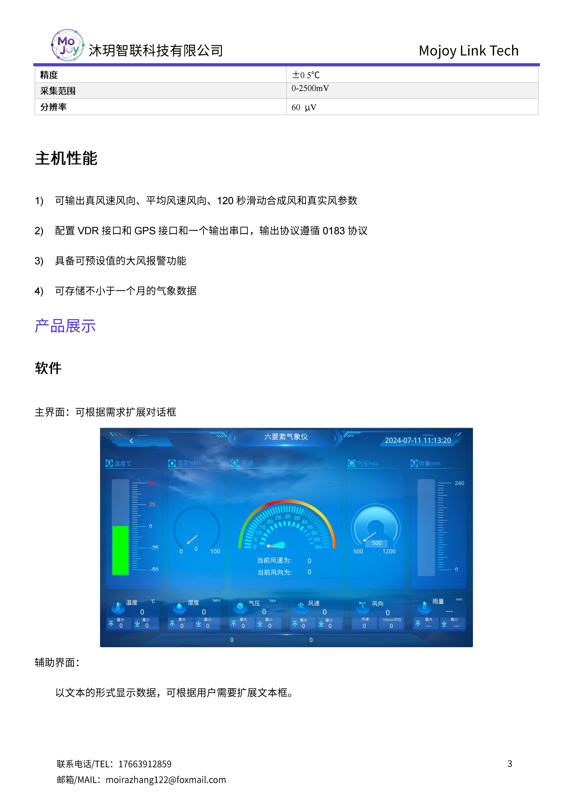
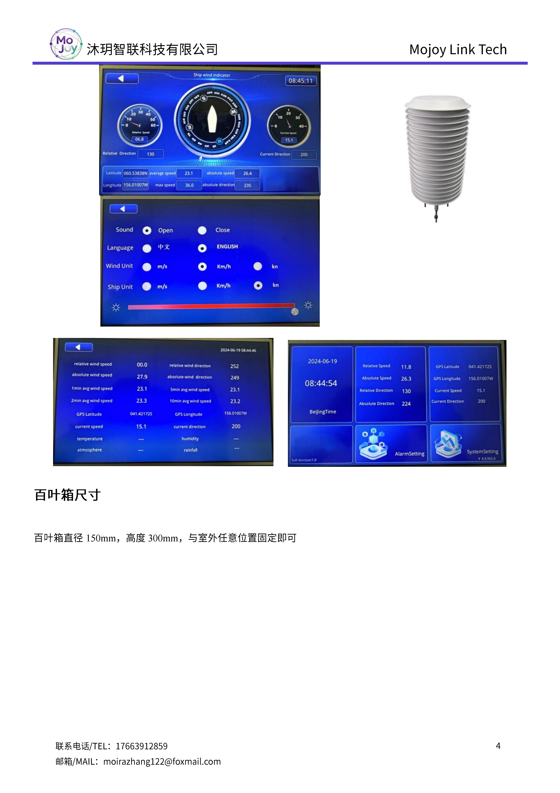
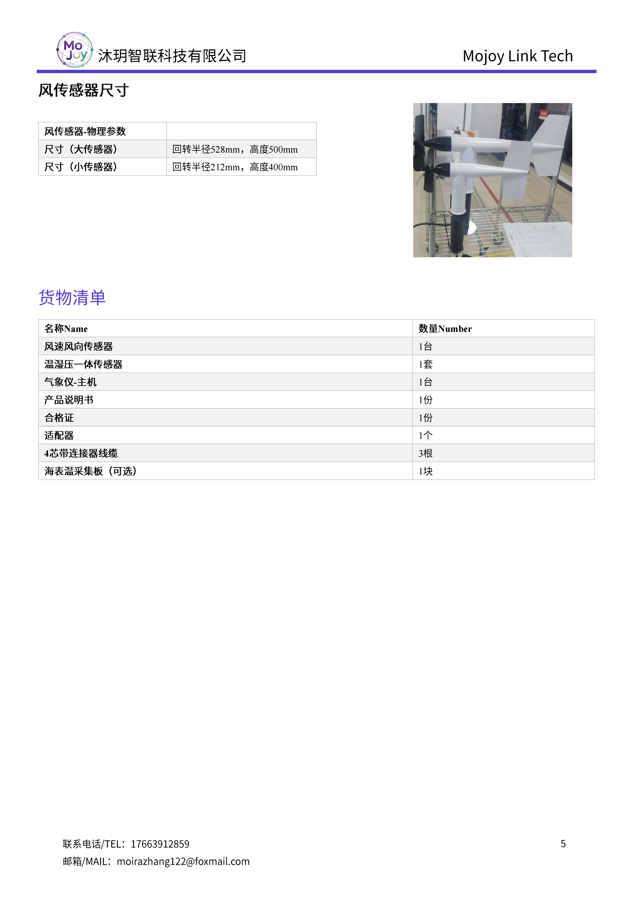

+++
title = "MET-MPS5 船舶数字气象仪"
description = "MET-MPS5 船用数字气象仪适配船舶、海上平台，可测真风 / 相对风、温湿气压，搭载 VDR、GPS IEC61162 标准接口，支持大风报警与月度数据存储，满足海上走航气象观测规范。"
summary = "MET-MPS5 专用船载数字气象系统，集成风速风向、温湿度、气压传感器，配套 GPS 计算真实风，兼容船舶 VDR 记录仪，具备大风预警、长期数据存储，适配各类船舶与海上平台走航监测。"
date = "2026-06-27T16:02:14+08:00"
draft = false
tags = [ "气象观测设备", "船舶数字气象仪" ]
keywords = [
  "MET-MPS5 数字气象仪",
  "船载气象仪",
  "船舶走航气象监测设备",
  "海上平台温湿压传感器",
  "船用真风测量系统",
  "IEC61162 VDR 气象记录仪"
]
+++

## 产品简介
MET-MPS5 是专为航运船舶、海上石油平台打造一体化数字气象观测系统，符合 JB/T9468-1999 数字气象仪行业标准，硬件接口遵循 IEC61162 海事通讯规范，完美适配海上走航作业环境。

设备配套风速风向、温湿压一体化传感单元（带专用百叶箱），可选海表温度采集模块；依托 GPS 信号精准计算真实风速风向，同步输出瞬时风、平均风、120s 合成风数据，自带大风阈值报警功能。

机身配备标准 VDR 数据存储接口、GPS 通讯串口，遵循 0183 传输协议，本地可存储不少于月度完整气象数据；提供大小两款风传感器选型，安装适配船舷、平台露天点位，全套配件完整，长期海上高盐雾环境稳定运行。

## 规格参数

## 适用场景
1. 远洋货轮、内河航运、公务船舶走航气象实时监测
2. 海上石油平台、离岸风电平台长期气象观测
3. 海事监管船、科考船海上走航环境数据采集
4. 港口船舶气象安全预警、大风风险监控
5. 海洋调查船配套海表温度、大气要素同步观测

