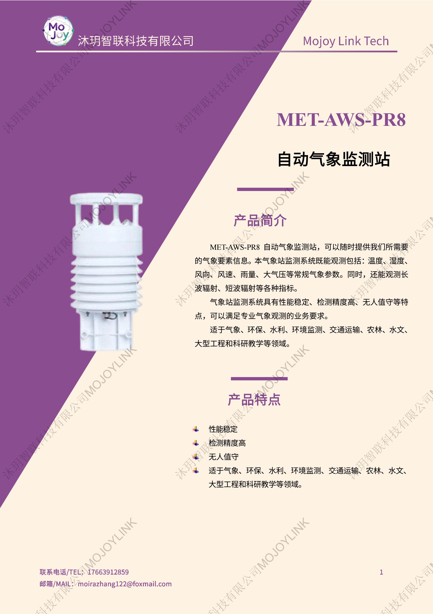
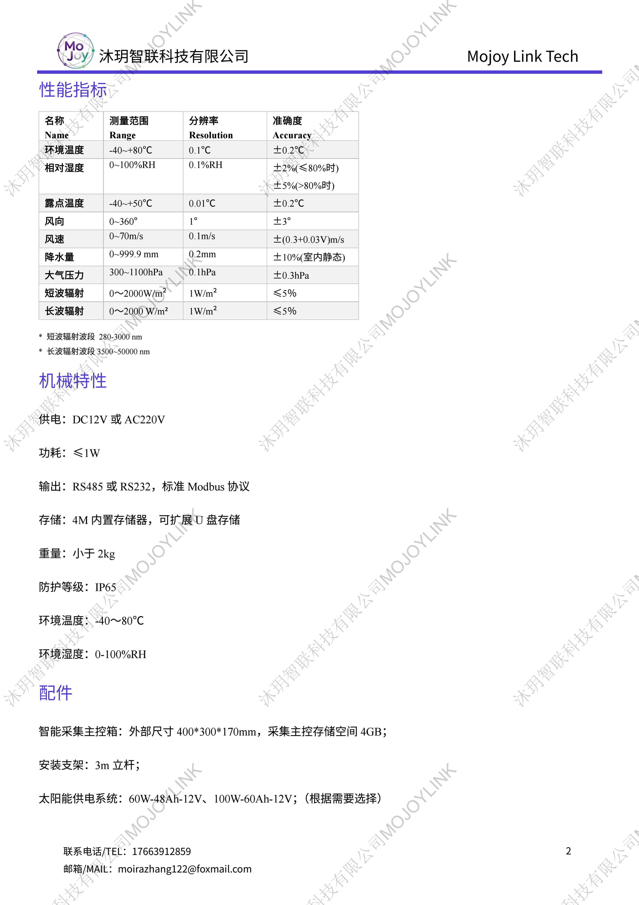
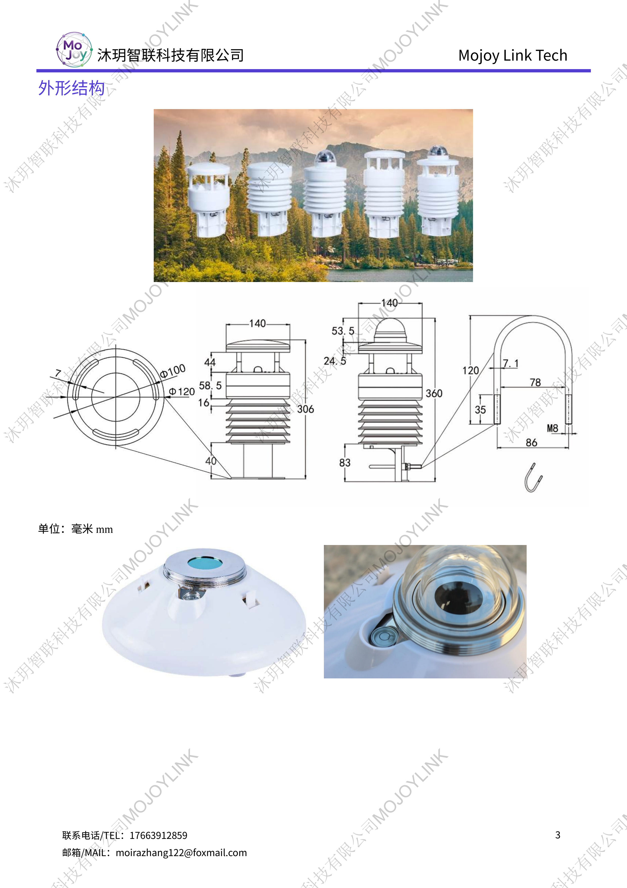

+++
title = "MET-AWS-PR8 自动气象监测站"
description = "MET-AWS-PR8 全自动气象监测站可采集温湿度、风速风向、雨量、辐射等气象要素，IP65防护，无人值守，适用于农林水利环保科研工程气象观测。"
summary = "MET-AWS-PR8自动气象监测站集成温湿度、风速风向、降水、辐射、大气压传感器，支持太阳能供电，全天候野外无人值守气象观测。"
date = "2026-06-26T22:06:36+08:00"
draft = false
tags = [ "气象观测设备" ]
weight = 1
keywords = [
  "农林气象站",
  "多要素气象观测设备",
  "水文气象监测设备",
  "自动气象监测站",
  "野外气象站",
  "MET-AWS-PR8气象站"
]
+++

## 产品简介
MET-AWS-PR8一体化自动气象监测站由沐玥智联研发，集成多类气象传感单元与智能采集主机，可同步采集温、湿、风、压、雨等常规气象与长波、短波辐射要素，以及其他定制化参数，设备检测精度高、运行稳定，整机IP65防护，可长期在野外环境无人值守运行。

设备支持市电、太阳能双供电方案，标准Modbus通讯协议，可对接各类物联网监测平台，广泛应用于气象、环保、水利、交通、农林、大型工程、科研教学等场景。

## 规格参数

## 适用场景
气象地面观测、流域水文监测、公路交通气象预警、农田果园气候监测、矿山基建环境监测、高校野外气象实验。

