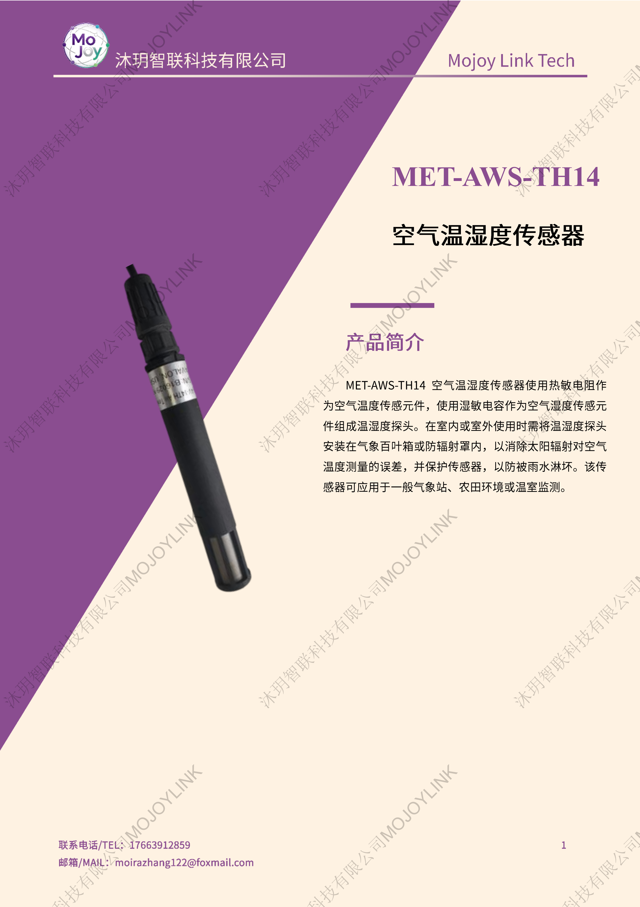
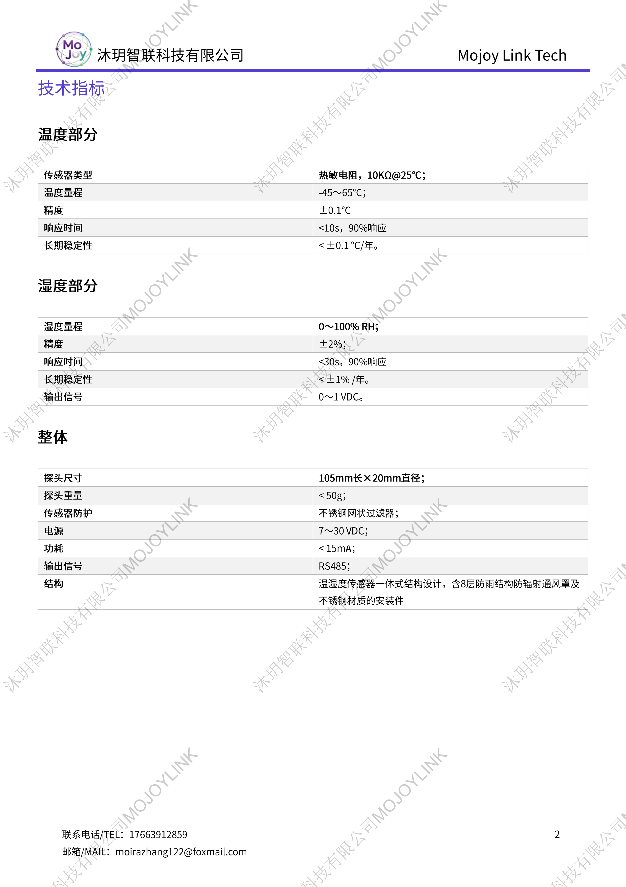

+++
title = "MET-AWS-TH14 空气温湿度传感器"
description = "MET-AWS-TH14 一体式空气温湿度传感器采用热敏电阻 + 湿敏电容，测温精度 ±0.1℃，自带防辐射通风罩，宽电压供电，适用于野外气象梯度、农田环境温湿度监测。"
summary = "MET-AWS-TH14 高精度温湿度传感器配备不锈钢滤网与防雨防辐射罩，温湿度长期稳定，RS485 信号输出，适配气象站野外长期温湿度连续观测。"
date = "2026-06-26T22:06:36+08:00"
draft = false
tags = [ "气象观测设备" ]
keywords = [
  "MET-AWS-TH14 温湿度传感器",
  "气象温湿度探头",
  "梯度观测温湿度传感器",
  "户外防辐射温湿度传感器",
  "RS485 空气温湿度传感器"
]

+++

## 产品简介
MET-AWS-TH14 是沐玥智联专为气象梯度观测研发的一体式空气温湿度传感器，测温元件选用 10KΩ 热敏电阻，测湿采用湿敏电容，测量精度高、年漂移量极小，长期野外使用数据稳定可靠。

探头集成 8 层防雨结构与不锈钢网状过滤防辐射通风罩，可规避阳光直射、雨水淋溅带来的测量误差；整机 7-30VDC 宽压供电，低功耗运行，支持 0-1VDC、RS485 双输出，可直接搭配气象采集主机组网使用，一体式小巧探头安装便捷。

## 规格参数

## 适用场景
1. 近地面气象梯度观测、野外标准气象站温湿度监测
2. 农田、果园、大田生态环境温湿度连续采集
3. 高校、科研院所野外气象实验观测
4. 园区、库区、流域户外环境气象监测
5. 小型全自动气象监测系统配套传感设备

