+++
title = "MET-AWS12 自动气象监测系统"
description = "MET-AWS12 自动气象监测系统具备多路模拟 / 脉冲采集通道，可搭配温湿度、风速风向、雨量、土壤等传感器，支持 SDI12/Modbus，低功耗宽温，配套 4G 传输、太阳能供电，适用于野外梯度气象、水文农田长期自动观测。"
summary = "MET-AWS12 多通道自动气象监测系统具备多路模拟 / 脉冲采集通道，可搭配温湿度、风、雨量、土壤多类气象传感器，支持 SD 卡本地存储、4G 无线传输，休眠低功耗，适配野外长期无人值守气象梯度观测。"
date = "2026-06-26T22:06:36+08:00"
draft = false
tags = [ "气象观测设备" ]
keywords = [
  "MET-AWS12 气象监测系统",
  "多通道气象数据采集器",
  "野外自动气象站",
  "SDI12 Modbus 气象采集设备",
  "梯度气象观测系统",
  "农田水文气象监测设备"
]
+++

## 产品简介
MET-AWS12 自动气象监测系统是沐玥智联推出的多功能一体化气象数据采集主机，设备搭载多路模拟、脉冲、计算采集通道，支持 SDI12、Modbus、RS485、USB 多类通讯协议，可配套温湿度、风速风向、翻斗雨量、土壤水分盐分等各类气象传感器组合搭建完整野外观测站。

采集器采用 24 位高精度 A/D 转换，具备低功耗休眠模式，内置 LCD 中英文显示屏，最大支持 32G SD 卡本地存储，兼容 3G/4G/5G、LoRa、Zigbee 无线传输模块；整机耐受 - 40~80℃宽温环境，搭配太阳能供电套件，无需市电即可长期野外无人值守运行。

广泛应用于近地面梯度气象观测、农田墒情监测、流域水文监测、科研野外气象实验、园区生态环境监测等场景，配套专用上位机软件，可实现数据实时查看、批量导出与自定义计算配置。

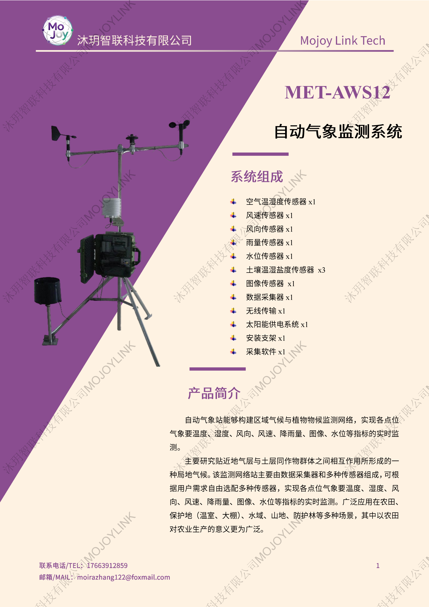

## 规格参数
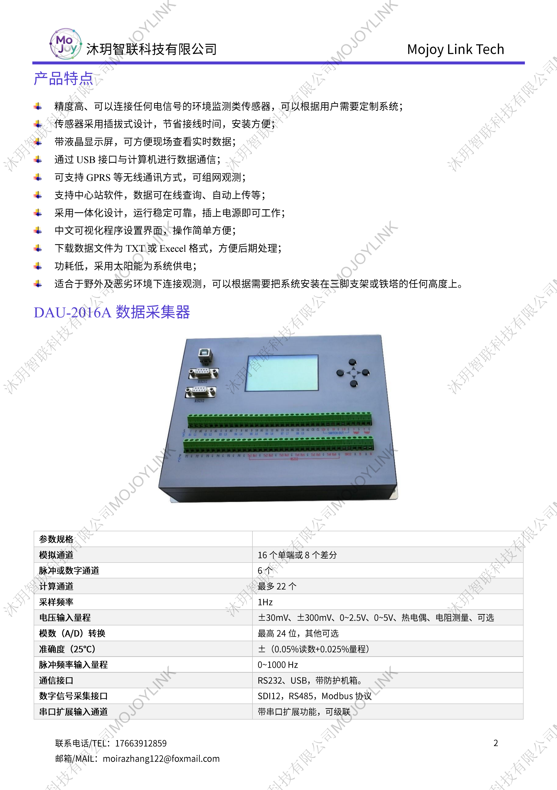
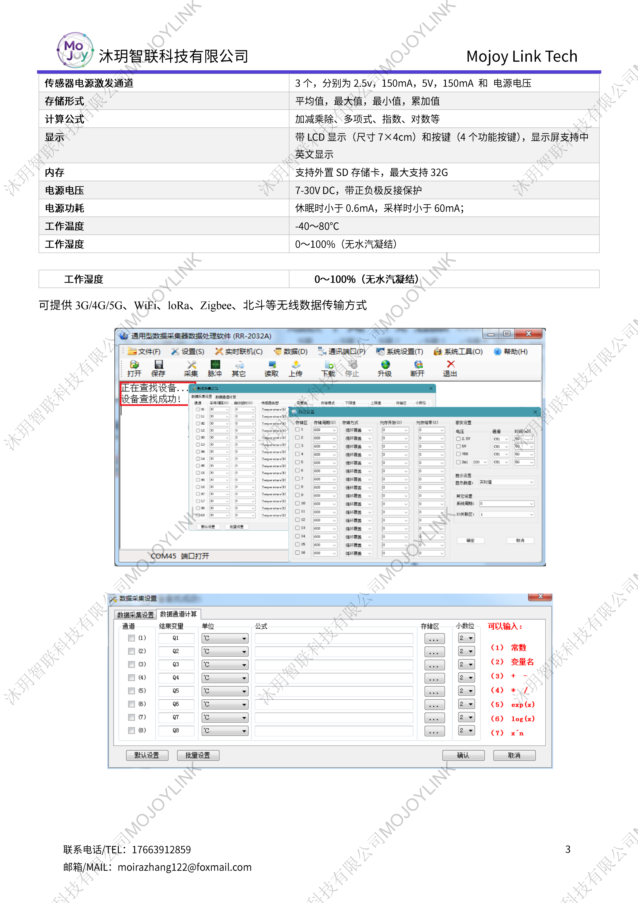
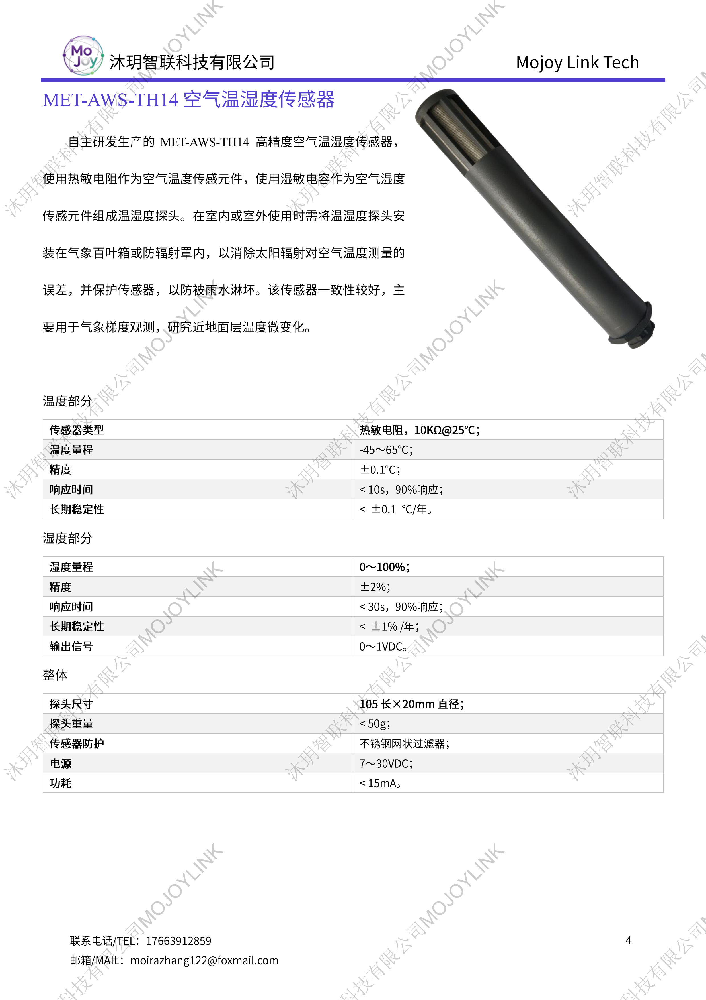
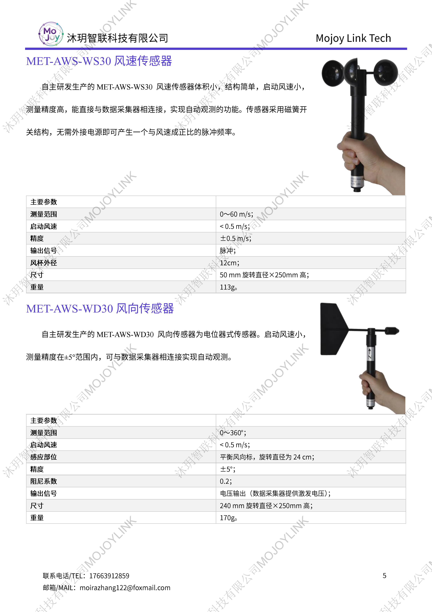
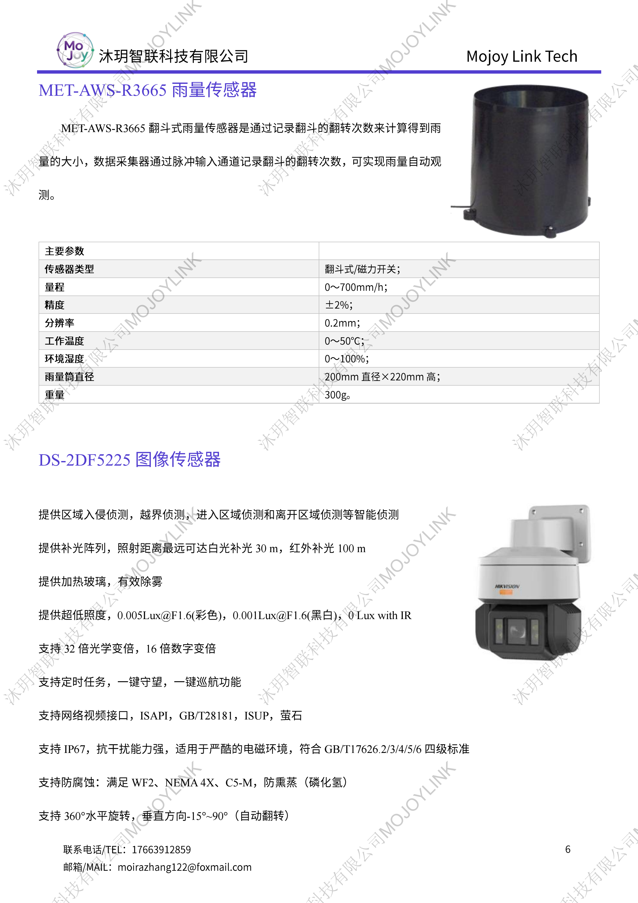
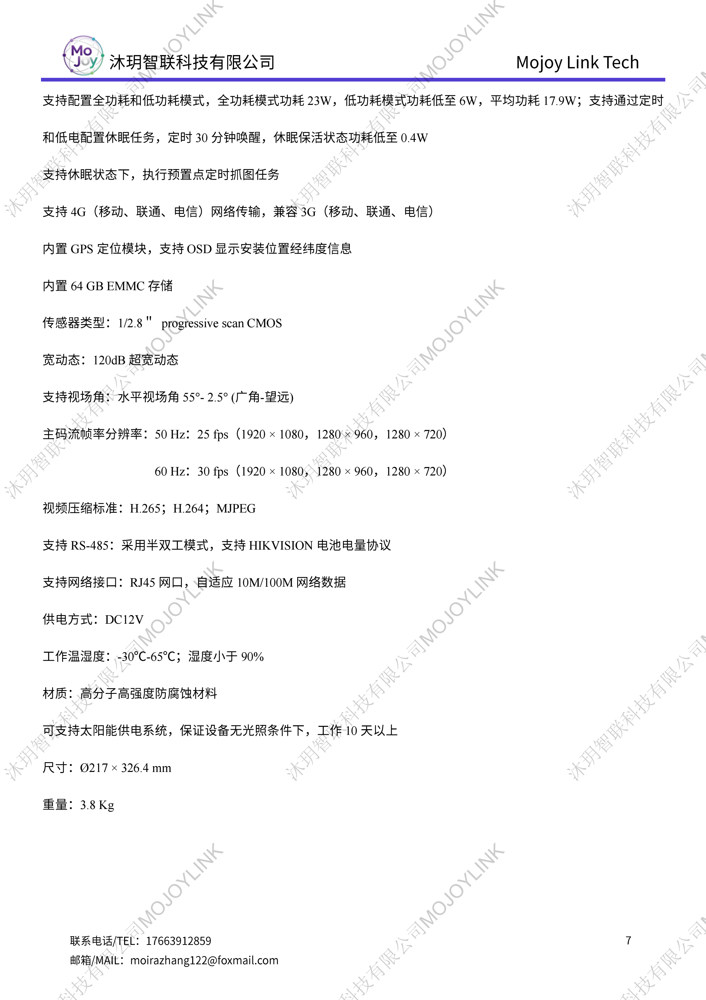
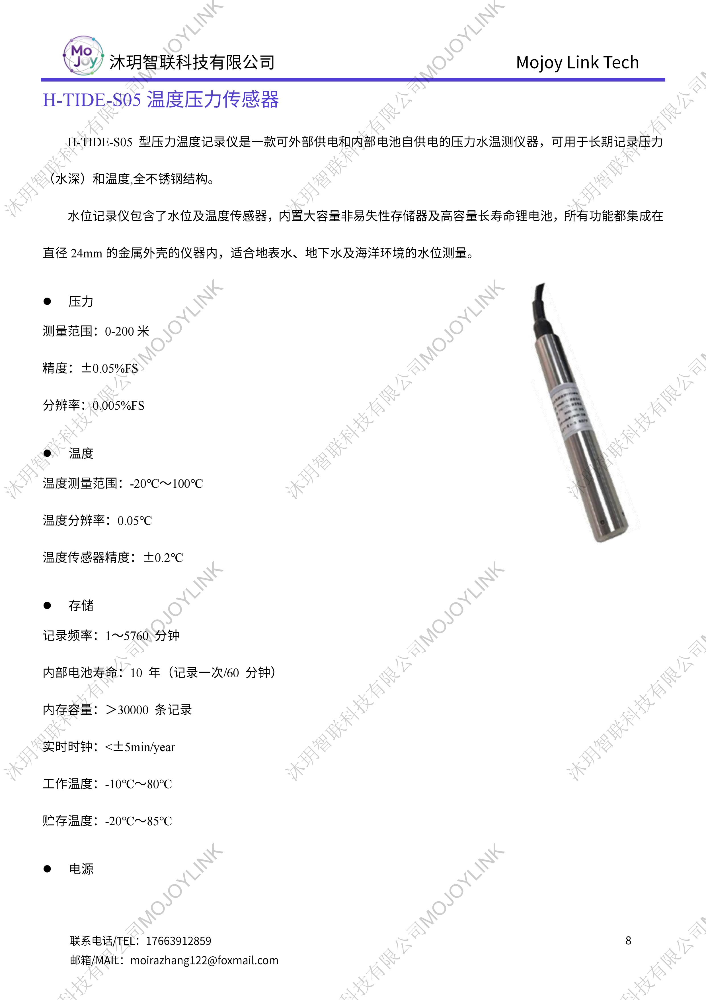
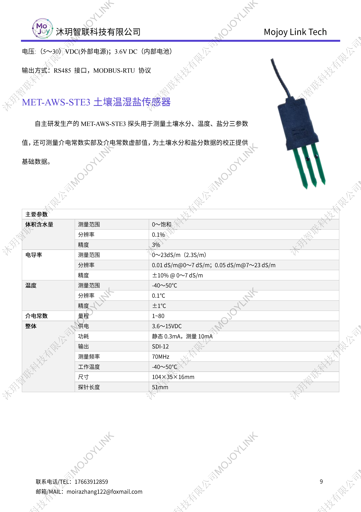
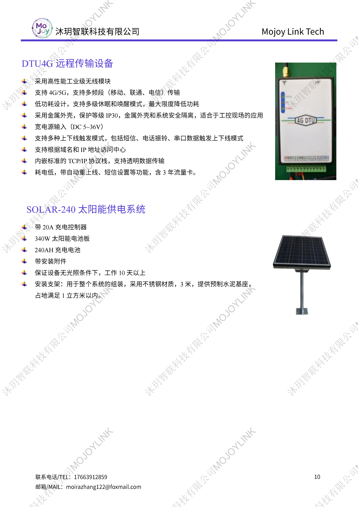
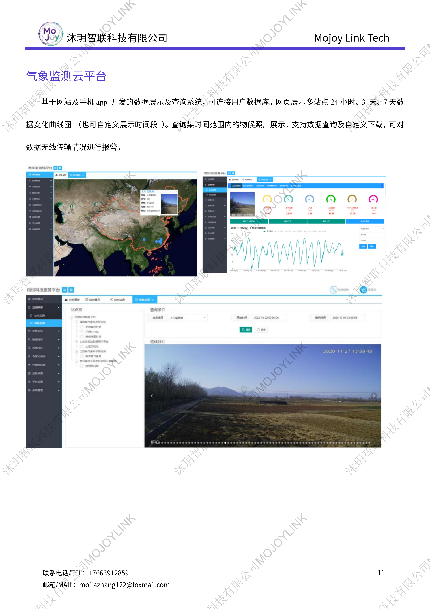
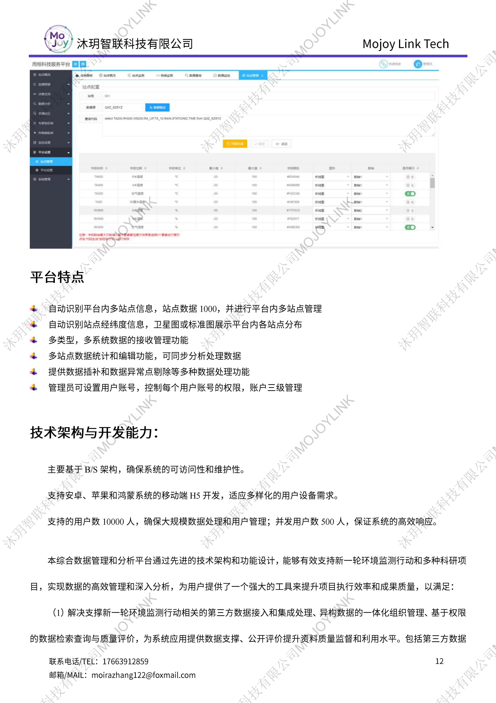
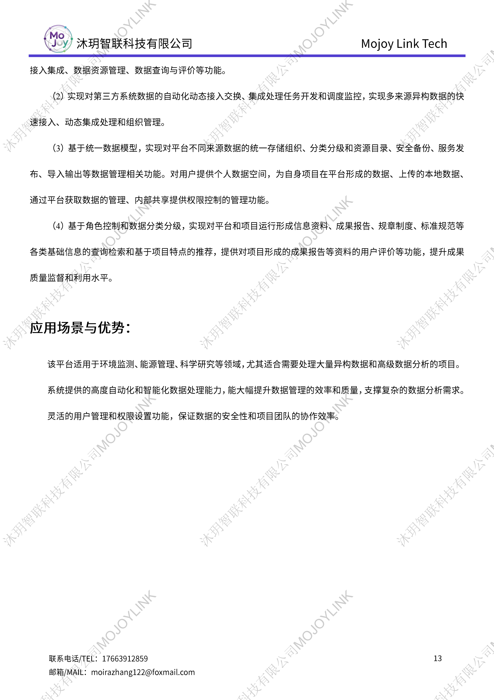

## 适用场景
广泛应用于近地面梯度气象观测、农田墒情监测、流域水文监测、科研野外气象实验、园区生态环境监测等场景，配套专用上位机软件，可实现数据实时查看、批量导出与自定义计算配置。

