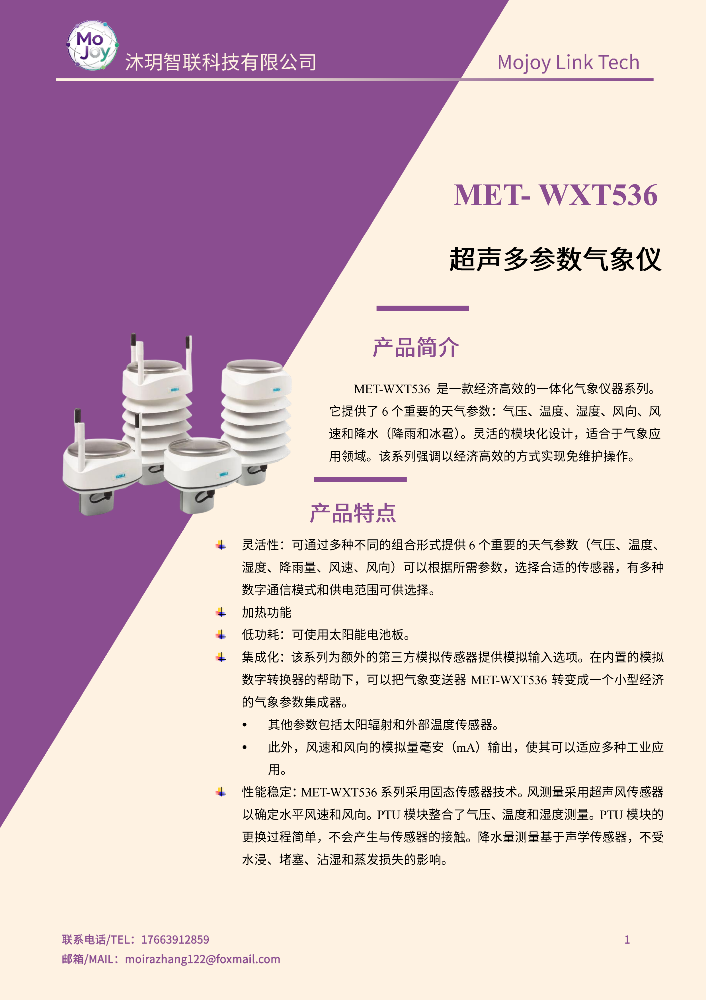
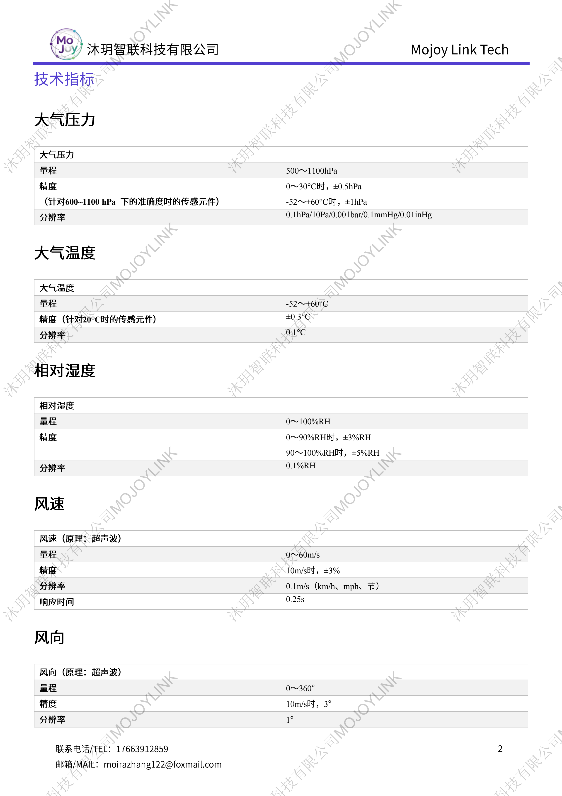
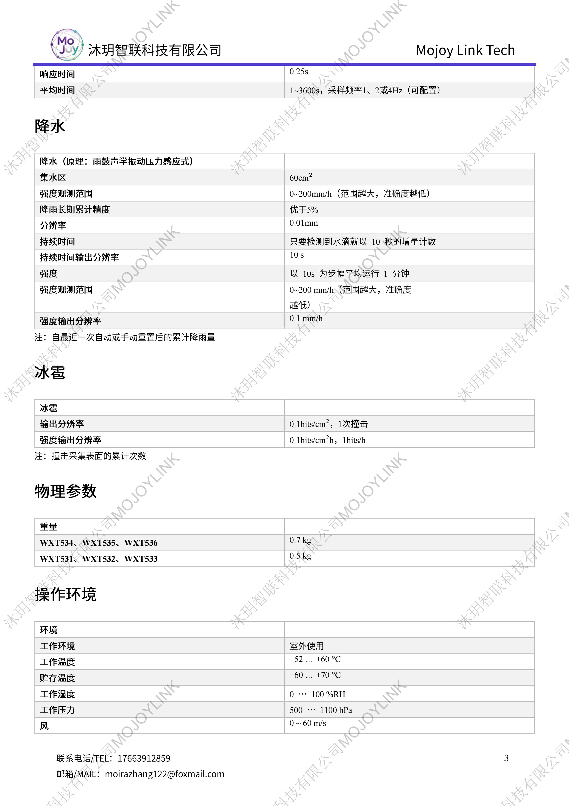
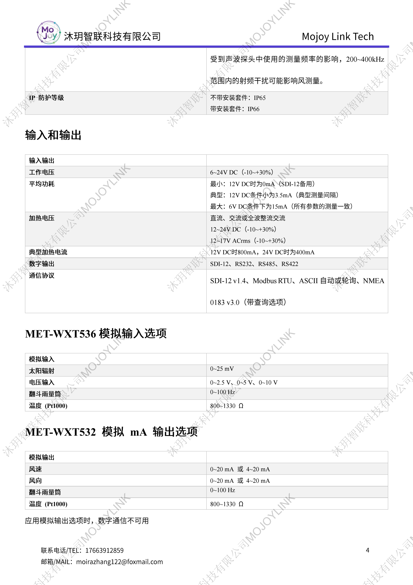
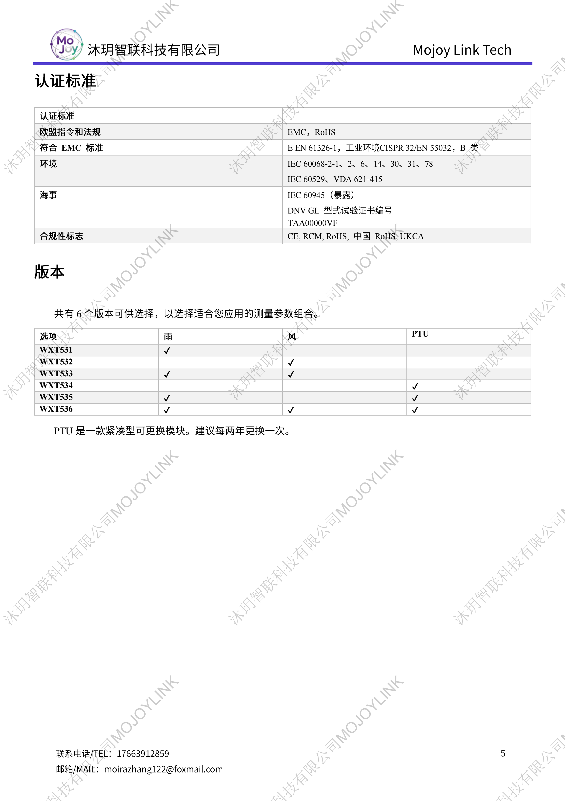

+++
title = "MET-WXT536 超声多参数气象仪"
description = "MET-WXT536 一体式超声气象仪集成温湿压、超声风速风向、声学雨量冰雹检测，IP66 防护，支持 Modbus/SDI-12/NMEA 多协议，宽温耐候，适合船舶、野外、港口全天候观测。"
summary = "MET-WXT536 无机械风杯超声气象传感器，同步采集温湿度气压、风、降雨、冰雹，多种通讯输出，高低温高湿稳定运行，小型一体化免维护气象探测设备。"
date = "2026-06-27T17:30:09+08:00"
draft = false
tags = [ "气象观测设备" ]
keywords = [
  "MET-WXT536 气象仪",
  "超声六要素气象传感器",
  "声学雨量冰雹检测仪",
  "一体式微型气象站",
  "SDI-12 Modbus 气象探头"
]
+++

## 产品简介
MET-WXT536 是一体化超声多参数气象仪，采用超声波测风方案，无传统风杯、风向标机械结构，不存在磨损卡顿问题；集成 PTU 温湿压模块、声学雨鼓降雨与冰雹检测单元，一台设备可同步采集六项核心气象要素。

设备采用 IP66 高防护外壳，工作温度覆盖 -52℃至+60℃，耐受全湿度户外恶劣环境；支持 SDI-12、Modbus RTU、NMEA 0183、RS485/232 多路通讯输出，兼容 4~20mA 模拟信号，供电适配 6-24VDC 宽压。

雨量采用声学振动感应原理，不受积水、泥沙堵塞影响，可区分降雨、冰雹并记录撞击频次；整机仅 0.7kg 轻量化设计，通过 CE、UKCA、DNV GL 船用相关认证，满足工业、海事野外长期免值守观测需求。

## 规格参数

## 适用场景
1. 船舶、海上平台、港口码头海事气象走航监测
2. 高速、轨道交通沿线小型气象预警点位
3. 光伏、风电厂区微气象环境监测
4. 城市街道、园区小型网格化气象站
5. 野外科研、生态林区无维护长期观测

