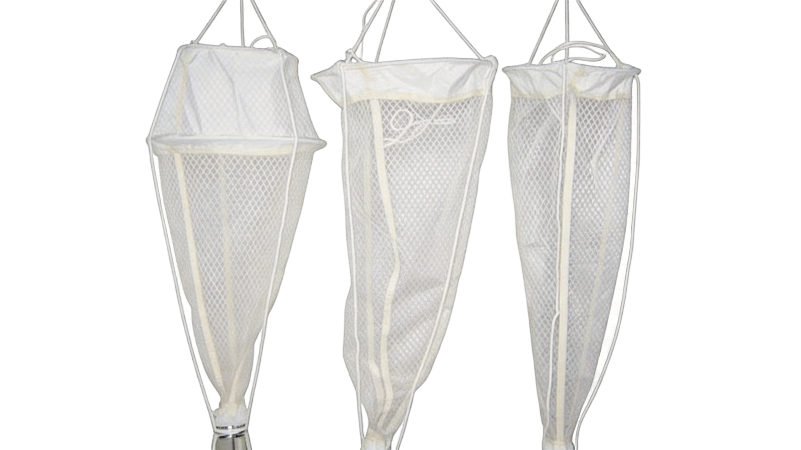

+++
title = "SAM-PLN-SH 浅海浮游生物网（Ⅰ型、Ⅱ型、Ⅲ型）"
description = "SAM-PLN-SH 浅海浮游生物网是近海、港湾、河口等浅海水域专用的浮游生物定性定量采样设备，严格遵循海洋生态调查规范设计，含 Ⅰ 型（Φ50cm 网口×0.20㎡/CQ14或JP12，大型浮游动物+鱼卵仔稚鱼）、Ⅱ 型（Φ31.6cm 网口×0.08㎡/CB36或JP36，带50cm头锥部+Φ50cm中网圈，中小型浮游动物）、Ⅲ 型（Φ37cm 网口×0.10㎡/JF62或JP80，浮游植物专用）三档规格，三档均采用 Φ10mm 圆不锈钢条网口圈+细帆布衔接+标准筛绢过滤+细帆布网底 Φ9×5cm 组成，适配科考船、小型作业艇、岸基投放、绞车部署，广泛用于海洋生态监测、水环境检测、科研调查、海洋环评、院校实验。"
summary = "SAM-PLN-SH 浅海浮游生物网为浅海港湾河口专用 3 档规格系列生物采样设备：Ⅰ型（Φ50cm/0.20㎡/CQ14或JP12，全长145cm，大型浮游动物+鱼卵仔稚鱼）、Ⅱ型（Φ31.6cm/0.08㎡/CB36或JP36，全长140cm+头锥部35cm+Φ50cm中网圈，中小型浮游动物）、Ⅲ型（Φ37cm/0.10㎡/JF62或JP80，全长140cm，浮游植物专用），三档均为 Φ10mm 不锈钢网口圈+细帆布+标准筛绢+Φ9×5cm细帆布网底三部分组成（Ⅱ型额外含头锥部中网圈），严格遵循海洋生态调查规范，适配科考船/小艇/岸基投放/绞车4类部署方式，可采集浮游植物、浮游动物、鱼卵仔稚鱼全粒级浅海浮游生物样本。"
date = "2026-08-04T06:30:00+08:00"
draft = false
tags = [ "海洋采样设备" ]
keywords = [
  "SAM-PLN-SH",
  "浅海浮游生物网",
  "港湾河口浮游生物采样",
  "海洋生态调查规范设备",
  "Ⅰ/Ⅱ/Ⅲ型三档规格",
  "CQ14/CB36/JF62标准筛绢",
  "鱼卵仔稚鱼采样网",
  "海洋环评院校实验采样"
]
+++

## 产品简介

**SAM-PLN-SH 浅海浮游生物网**是**近海、港湾、河口**等浅海水域专用的浮游生物定性定量采样设备，严格遵循**海洋生态调查规范**设计。主要用于采集水体中**浮游植物**、**浮游动物**、**鱼卵仔稚鱼**等水生生物样本，广泛应用于海洋生态监测、水环境检测、科研调查、海洋环评、院校实验等场景。

设备适配浅海常规作业水深，兼容性强，可搭配**科考船、小型作业艇、岸基投放设备及配套绞车**使用，是近海海洋生物采样的核心基础设备。

## 产品特点

**SAM-PLN-SH 浅海浮游生物网**具备以下四大核心特点：

1. **严格遵循海洋生态调查规范 · 近海港湾河口专用**

   整机设计、网口尺寸、筛绢选型、结构比例均严格遵循海洋生态调查规范的标准要求，采样结果具法定方法可比性，适用于海洋环境监测、环评、科研等各类合规性调查任务。

2. **Ⅰ / Ⅱ / Ⅲ 三档规格齐全 · 覆盖全粒级浅海浮游生物采样**

   系列覆盖三档规格，分别匹配不同粒级与类型的浅海生物采样：
   - **Ⅰ 型**：大粒级 → 大型浮游动物、鱼卵、仔稚鱼
   - **Ⅱ 型**：中粒级 → 中小型浮游动物（独有**导流头锥部 + Φ50cm 中网圈**设计，减少生物逃逸，采样效率高）
   - **Ⅲ 型**：细粒级 → 浮游植物定量采集

3. **Φ10mm 不锈钢网口圈 + 细帆布衔接 + 标准筛绢 · 坚固耐用易清洗**

   三档统一采用 Φ10mm 圆不锈钢条制作网口圈，抗锈蚀、抗形变；细帆布作为接口与衔接部位缝合紧密、抗撕裂；筛绢全部采用 CQ / CB / JF / JP 系列海洋调查标准筛绢型号，孔径稳定、滤水效率高；整套设备可反复清洗、长期使用，维护更换成本低。

4. **多场景部署兼容 · 科考船 / 小型作业艇 / 岸基投放 / 配套绞车 4 类**

   结构设计轻巧，部署方式灵活：
   - **大型科考船**：配合绞车用于调查断面大面站标准采样
   - **小型作业艇 / 快艇**：近岸快速机动采样、临时应急监测
   - **岸基投放**：码头、平台、养殖区、入海排污口定点监测
   - **配套流量计 / 深度计**：实现定量采样、通量计算、深度分布调查

## 规格与技术参数

| **参数项** | **Ⅰ 型** | **Ⅱ 型** | **Ⅲ 型** |
|-----------|---------|---------|---------|
| **网口内径** | Φ50 cm | Φ31.6 cm | Φ37 cm |
| **采样面积** | 0.20 ㎡ | 0.08 ㎡ | 0.10 ㎡ |
| **全长** | 145 cm | 140 cm（含头锥部总长） | 140 cm |
| **结构组成** | 三部分组成： ①上口部（长5cm细帆布） ②过滤部（长135cm筛绢） ③网底部（Φ9cm×5cm细帆布） | 三部分 + 头锥部中网圈： ①头锥部（长35cm细帆布，配 **Φ50cm 中网圈**，导流作用） ②过滤部（长100cm筛绢） ③网底部（Φ9cm×5cm细帆布） | 三部分组成： ①上口部（长5cm细帆布） ②过滤部（长130cm筛绢） ③网底部（Φ9cm×5cm细帆布） |
| **筛绢型号** | CQ14 或 JP12（粗筛绢，大粒级） | CB36 或 JP36（中筛绢，中粒级） | JF62 或 JP80（细筛绢，细粒级） |
| **网底尺寸** | Φ9 cm × 5 cm（细帆布，三档通用） | Φ9 cm × 5 cm（细帆布，三档通用） | Φ9 cm × 5 cm（细帆布，三档通用） |
| **网口圈材质** | Φ10 mm 圆不锈钢条（三档通用） | Φ10 mm 圆不锈钢条（三档通用） | Φ10 mm 圆不锈钢条（三档通用） |
| **典型采集对象** | 大型浮游动物、鱼卵、仔稚鱼 | 中小型浮游动物（导流型，效率高） | 浮游植物（定量采集专用） |

## 部署与作业方式

SAM-PLN-SH 浅海浮游生物网支持以下四类典型部署与作业方式：

1. **科考船配套绞车**

   在标准海洋调查航次中，配合科考船甲板绞车按规范操作流程执行，适用于大面站、断面站的系统性调查，可配套流量计实现精确定量采样。

2. **小型作业艇（快艇 / 渔船）**

   近岸港湾、河口、养殖区等区域的快速机动采样，无需大型专业设备即可高效部署，适合环境应急监测、临时断面调查、海洋工程环评的补充采样。

3. **岸基定点投放**

   从码头、海洋平台、浮标、养殖区栈桥、入海排污口附近直接人工投放，适用于长期固定站位的例行监测、重点污染源溯源调查。

4. **配套流量计 / 深度计组合作业**

   可配套安装通用型海洋浮游生物流量计、压力式深度计等装置，实现过滤水量精确计量，从而完成浮游生物丰度、生物量等定量计算以及垂向深度分布调查。

## 应用领域

**SAM-PLN-SH 浅海浮游生物网**的典型应用领域包括：

1. **海洋生态监测** · 近岸海域海洋生态健康例行监测、海洋保护区生态状况调查、赤潮/绿潮等生态灾害监测预警采样
2. **水环境检测** · 海洋水环境质量调查、入海排污口溯源监测、河流河口污染物迁移扩散调查
3. **科研调查** · 高校、海洋科研院所开展的浅海浮游生物多样性、群落结构、食物网、生态功能等基础研究
4. **海洋环评** · 围填海工程、港口航道疏浚、海上风电、人工鱼礁、海洋牧场等项目的施工前/中/后环境影响评价采样
5. **院校实验教学** · 海洋科学、水产科学、环境科学、生态学等专业的教学实习、学生实验与课程实践

## 型号选型建议

| **型号** | **推荐选型场景** |
|---------|----------------|
| **Ⅰ 型（Φ50cm / CQ14 或 JP12）** | 大型浮游动物、鱼卵、仔稚鱼采样；渔业资源早期补充量调查；鱼卵仔稚鱼种类鉴定与丰度研究；环评生态调查中鱼类浮游生物专项采样 |
| **Ⅱ 型（Φ31.6cm / CB36 或 JP36，含头锥部中网圈）** | 中小型浮游动物定量定性采样；海洋生态监测常规年度任务；导流型结构设计适合要求高采样效率、低逃逸率的正式调查 |
| **Ⅲ 型（Φ37cm / JF62 或 JP80）** | 浮游植物定量采集（专用型号）；叶绿素 a、初级生产力、浮游植物种类组成与细胞丰度分析；富营养化评价、赤潮预警监测 |

💡 选型提示：完整的海洋生态调查建议采用 **Ⅰ + Ⅱ + Ⅲ 三档组合配套**，通过一次出海同步获取全粒级的浮游生物样本（浮游植物 → 中小型浮游动物 → 大型浮游动物 + 鱼卵仔稚鱼），形成完整的浮游生物群落粒级谱数据，满足海洋生态系统、食物网、生态健康评价等研究需求。

---

  下载产品彩页
