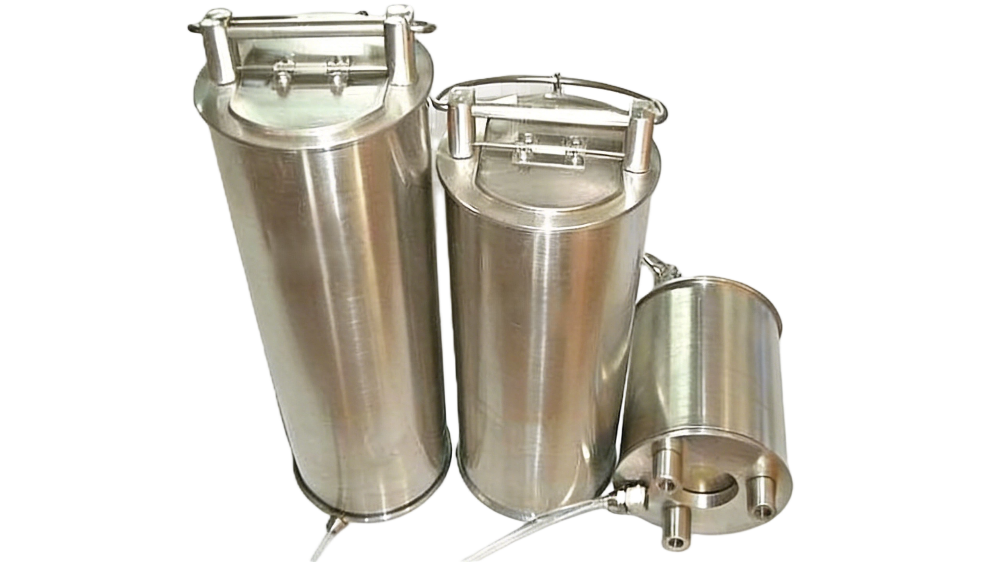
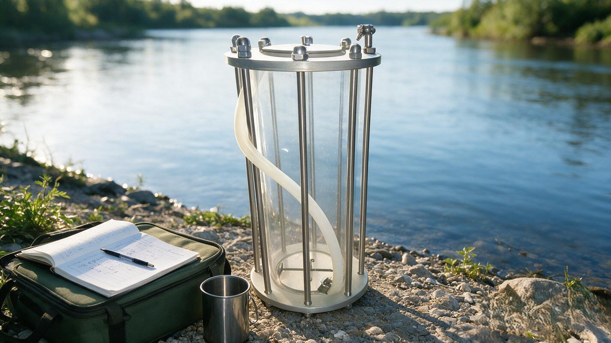
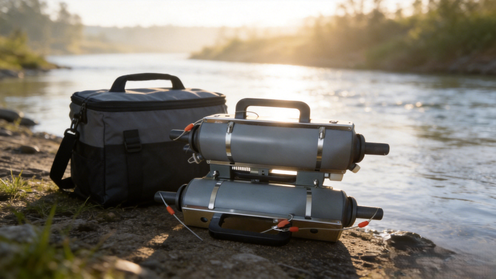

+++
title = "SAM-WAT 系列采水器（不锈钢/不锈钢有机玻璃/UPVC卡盖式）"
description = "SAM-WAT 系列采水器是海洋、江河、湖泊任意深度定层水样采集的通用设备，坚固耐用、使用简便、成功率高，顶部圆盖开合便捷，底部带圆孔+浮动板保证水流自由贯通，可采集任意预定水层。系列含 3 大材质类别共 17 个型号：①不锈钢 S 类（S2.5/S3/S5/S10/S20，螺扣无焊接耐海水，方形出水嘴+304使锤可串联）；②不锈钢有机玻璃 P 类（P2.5/P3/P5/P10/P20，透明直接观察水样）；③UPVC 卡盖式 H/V 类（H2.5/H5/H10 水平结构 + V2.5/V5/V10 垂直结构，耐酸碱腐蚀适合微生物细菌及腐蚀性样品），广泛用于海洋水文调查、环境污染监测采样、微生物指标分析、海水腐蚀性样品采集。"
summary = "SAM-WAT 系列采水器是定层水样采集通用型设备，顶部圆盖开合便捷，底部圆孔浮动板结构下沉时水流贯通，成功率高、坚固耐用、使用简便，覆盖 3 大材质类 17 个型号：①不锈钢 S 类 5 型号（SAM-WAT-S2.5/S3/S5/S10/S20，2.5L/3L/5L/10L/20L 优质不锈钢耐海水腐蚀，螺扣无焊接，方形直角出水嘴螺纹旋帽，304使锤可多台串联挂锤）；②不锈钢有机玻璃 P 类 5 型号（SAM-WAT-P2.5/P3/P5/P10/P20，2.5L/3L/5L/10L/20L 透明有机玻璃可直观观察水样颜色浊度悬浮物）；③UPVC 卡盖式 H 水平 + V 垂直 6 型号（H2.5/H5/H10 + V2.5/V5/V10，2.5L/5L/10L 耐酸碱腐蚀，适合微生物细菌指标分析与含腐蚀性样品海水采样）。"
date = "2026-08-04T07:00:00+08:00"
draft = false
tags = [ "海洋采样设备" ]
keywords = [
  "SAM-WAT",
  "系列采水器",
  "定层水样采集器",
  "不锈钢采水器",
  "不锈钢有机玻璃采水器",
  "UPVC卡盖式采水器",
  "海洋环境污染监测采水设备",
  "微生物细菌水样采集"
]
+++

## 产品简介

**SAM-WAT 系列采水器**是**海洋、江河、湖泊**等水域**任意深度定层水样采集**的通用型设备，具有**坚固耐用、使用简便、采样成功率高**的核心特点。

设备采用**顶部圆盖开合便捷**设计，**底部带圆孔 + 浮动板**结构保证下沉时水流自由贯通、到达预定水层后受冲击即触发闭锁，可精准采集任意预定水层的代表性水样。

系列覆盖**3 大材质类别共 17 个型号**，可满足不同采样场景、不同样品类型（常规理化 / 微生物 / 腐蚀性样品）、不同容量规格的差异化需求，是海洋水文调查、环境污染监测、科研实验的基础采样装备。

## 产品特点

**SAM-WAT 系列采水器**具备以下五大核心特点：

1. **顶部圆盖开合便捷 + 底部圆孔浮动板 · 采样成功率高**

   顶部圆盖开合顺畅、操作便捷；底部圆孔配浮动板的双保险结构，下沉时水流贯通阻力小、到达目标水层后使锤触发即可快速闭锁，采样成功率稳定，平行样一致性好。

2. **3 大材质类别齐全 · 17 个型号覆盖全场景**

   - **① 不锈钢 S 类（5 型号）**：S2.5 / S3 / S5 / S10 / S20，优质不锈钢材质，耐海水腐蚀，螺扣无焊接结构强度高
   - **② 不锈钢有机玻璃 P 类（5 型号）**：P2.5 / P3 / P5 / P10 / P20，筒体透明可直接观察水样状态
   - **③ UPVC 卡盖式 H/V 类（6 型号）**：H2.5 / H5 / H10（水平结构）+ V2.5 / V5 / V10（垂直结构），耐酸碱腐蚀，适配微生物及腐蚀性样品

3. **不锈钢 S 类：螺扣无焊接 + 方形出水嘴 + 304 使锤可串联**

   不锈钢款采用**螺扣无焊接**工艺，整体结构强度高、耐海水腐蚀；**方形直角出水嘴**配螺纹旋帽，倒样与转移水样方便；配套**304 不锈钢使锤**，支持多台采水器串联挂锤同步作业，一次下放完成多层水样采集。

4. **不锈钢有机玻璃 P 类：筒体透明 · 直观监控水样状态**

   筒体采用高透有机玻璃材质，采样全程可直接观察水样的颜色、浊度、悬浮物等状态，避免异常样品混入，提升采样数据质量。

5. **UPVC 卡盖式 H/V 类：耐酸碱腐蚀 · 微生物 / 腐蚀性样品专用**

   UPVC 材质具优异的耐酸碱腐蚀性能，分**水平结构（H 类）**与**垂直结构（V 类）**两种结构形式，卡盖式启闭可靠，特别适合**微生物细菌指标分析**水样采集与含有**腐蚀性成分**（强酸/强碱/重金属/有机溶剂等）的海水样品采集。

## 规格与技术参数

### 系列一：不锈钢采水器（S 类）

| **参数项** | **SAM-WAT-S2.5** | **SAM-WAT-S3** | **SAM-WAT-S5** | **SAM-WAT-S10** | **SAM-WAT-S20** |
|-----------|-----------------|---------------|---------------|----------------|----------------|
| **标称容量** | 2.5 L | 3 L | 5 L | 10 L | 20 L |
| **材质** | 优质不锈钢（螺扣无焊接） | 优质不锈钢（螺扣无焊接） | 优质不锈钢（螺扣无焊接） | 优质不锈钢（螺扣无焊接） | 优质不锈钢（螺扣无焊接） |
| **结构特点** | 顶部圆盖 + 底部圆孔浮动板；方形直角出水嘴（螺纹旋帽）；适配 304 不锈钢使锤，支持多台串联挂锤 | 同 S2.5 | 同 S2.5 | 同 S2.5 | 同 S2.5 |
| **适用场景** | 小容量海洋水文调查常规采样、近岸浅层水样采集 | 中小容量常规水质调查采样 | 通用型常规采样，覆盖多数需求 | 大容量采样，适合实验室多指标分析共用 | 超大容量采样，适合大体积样品前处理与富集分析 |
| **耐腐蚀性** | 耐海水腐蚀 | 耐海水腐蚀 | 耐海水腐蚀 | 耐海水腐蚀 | 耐海水腐蚀 |

 不锈钢采水器

---

### 系列二：不锈钢有机玻璃采水器（P 类）

| **参数项** | **SAM-WAT-P2.5** | **SAM-WAT-P3** | **SAM-WAT-P5** | **SAM-WAT-P10** | **SAM-WAT-P20** |
|-----------|-----------------|---------------|---------------|----------------|----------------|
| **标称容量** | 2.5 L | 3 L | 5 L | 10 L | 20 L |
| **筒体材质** | 透明有机玻璃 | 透明有机玻璃 | 透明有机玻璃 | 透明有机玻璃 | 透明有机玻璃 |
| **结构特点** | 顶部圆盖 + 底部圆孔浮动板；筒体高透可直接观察水样颜色、浊度、悬浮物 | 同 P2.5 | 同 P2.5 | 同 P2.5 | 同 P2.5 |
| **适用场景** | 需要直观监控水样状态的小容量采样 | 中小容量且需目视确认水样状况的场景 | 通用型透明采水器，兼顾容量与可观察性 | 大容量且需目视检查的多指标分析采样 | 超大容量透明采样，适合教学演示与大体积目视监测 |
| **可视性** | 全程可目视观察水样 | 全程可目视观察水样 | 全程可目视观察水样 | 全程可目视观察水样 | 全程可目视观察水样 |

 不锈钢有机玻璃采水器

---

### 系列三：UPVC 卡盖式采水器（H 水平类 + V 垂直类）

| **参数项** | **H 水平类（H2.5 / H5 / H10）** | **V 垂直类（V2.5 / V5 / V10）** |
|-----------|--------------------------------|--------------------------------|
| **标称容量** | 2.5 L / 5 L / 10 L | 2.5 L / 5 L / 10 L |
| **材质** | UPVC（耐酸碱腐蚀） | UPVC（耐酸碱腐蚀） |
| **结构形式** | 水平结构，卡盖式启闭 | 垂直结构，卡盖式启闭 |
| **结构特点** | 水平入水，水流贯通顺畅；卡盖闭锁可靠；耐酸碱、耐有机溶剂 | 垂直入水，下沉姿态稳定；卡盖闭锁可靠；耐酸碱、耐有机溶剂 |
| **适用场景** | 微生物细菌指标分析水样采集；含腐蚀性成分（强酸/强碱/重金属等）海水样品采集；通用型环境监测水样采集 | 同 H 类；对下沉姿态稳定性要求更高的深水定层采样 |
| **耐腐蚀性** | 优异（耐酸碱、耐多种有机溶剂与腐蚀性介质） | 优异（耐酸碱、耐多种有机溶剂与腐蚀性介质） |

 UPVC 卡盖式采水器

## 部署与作业方式

**SAM-WAT 系列采水器**支持以下四类典型部署与作业方式：

1. **单台下放 · 标准定层采样**

   单台采水器连接缆绳或钢丝绳，按预定深度匀速下放至目标水层，释放使锤触发闭锁后匀速回收，完成单个水层的定层水样采集。

2. **多台串联挂锤 · 一次下放多层同步采样**

   利用不锈钢 S 类的 304 使锤串联接口，将多台采水器按目标水层深度依次串联挂接，一次下放同步完成多个水层（表层/中层/底层等）的水样采集，大幅提升外业作业效率。

3. **配套绞车 / 水文绞车**

   在大型科考船或专用调查船上，配合甲板水文绞车按规范操作流程执行，可精准控制下放深度、下放速度与回收速度，适用于大面站、断面站的系统性水文调查任务。

4. **小艇 / 岸基人工投放**

   近岸港湾、河口、湖泊、水库等水域，通过小型作业艇或从码头、平台、栈桥直接人工投放，部署灵活快速，适合环境应急监测、临时断面调查、入河（海）排污口溯源采样。

## 应用领域

**SAM-WAT 系列采水器**的典型应用领域包括：

1. **海洋水文调查** · 近岸海域、近海大洋的海洋环境基本要素调查、标准断面监测、大面站水质采样
2. **环境污染监测采样** · 海洋环境质量例行监测、河流湖库地表水断面监测、入海（河）排污口溯源与污染物迁移扩散调查
3. **微生物指标分析** · UPVC 卡盖式采水器专用于细菌总数、大肠菌群、浮游微生物、病毒等微生物指标的低污染采样
4. **海水腐蚀性样品采集** · UPVC 卡盖式采水器耐酸碱腐蚀，适合含重金属、有机溶剂、酸碱等腐蚀性成分的海水/废水样品采集
5. **常规理化指标分析** · COD、氨氮、总磷总氮、悬浮物、盐度、pH、溶解氧等常规水质理化指标分析的配套采样
6. **科研院校教学实验** · 海洋科学、环境科学、水文水资源、水产科学等专业的教学实习、学生实验与课程实践
7. **应急监测与事故调查** · 溢油、化学品泄漏、赤潮绿潮、突发水污染事件等应急场景的快速响应采样

## 型号选型建议

| **选型需求** | **推荐型号** | **选型说明** |
|------------|------------|------------|
| 通用海洋水文调查 / 耐海水 / 多台串联多层采样 | **不锈钢 S 类（S2.5 / S3 / S5 / S10 / S20）** | 螺扣无焊接耐海水，方形出水嘴方便倒样，支持多台串联，适合标准外业调查 |
| 需要目视观察水样颜色 / 浊度 / 悬浮物 | **不锈钢有机玻璃 P 类（P2.5 / P3 / P5 / P10 / P20）** | 筒体高透，采样全程可直接确认水样状态，避免异常样品混入 |
| 微生物 / 细菌指标分析 | **UPVC 卡盖式（H2.5/H5/H10 或 V2.5/V5/V10）** | UPVC 材质低污染无溶出，卡盖闭锁可靠，是微生物采样的标准选择 |
| 含腐蚀性成分（酸碱 / 重金属 / 有机溶剂）的海水采样 | **UPVC 卡盖式（H2.5/H5/H10 或 V2.5/V5/V10）** | UPVC 优异的耐酸碱耐腐蚀性能，可避免金属材质与腐蚀性样品相互干扰 |
| 大容量、多指标共用同一样品 | **S10 / S20、P10 / P20、H10 / V10** | 10L / 20L 大容量型号，一次采样可满足实验室多指标分析的样品量需求 |
| 深水定层采样 / 下沉姿态要求高 | **UPVC 卡盖式 V 垂直类（V2.5 / V5 / V10）** | 垂直入水结构下沉姿态更稳定，闭锁时机更精准，适合深水定层采样 |

💡 选型提示：综合性海洋环境调查项目建议采用 **「不锈钢 S 类（常规理化）+ 不锈钢有机玻璃 P 类（目视质控）+ UPVC 卡盖式（微生物/腐蚀性样品）」三类组合配套**，通过一次出海同步完成不同用途、不同指标的定层水样采集，形成完整的水质采样体系。

---

  下载产品彩页

