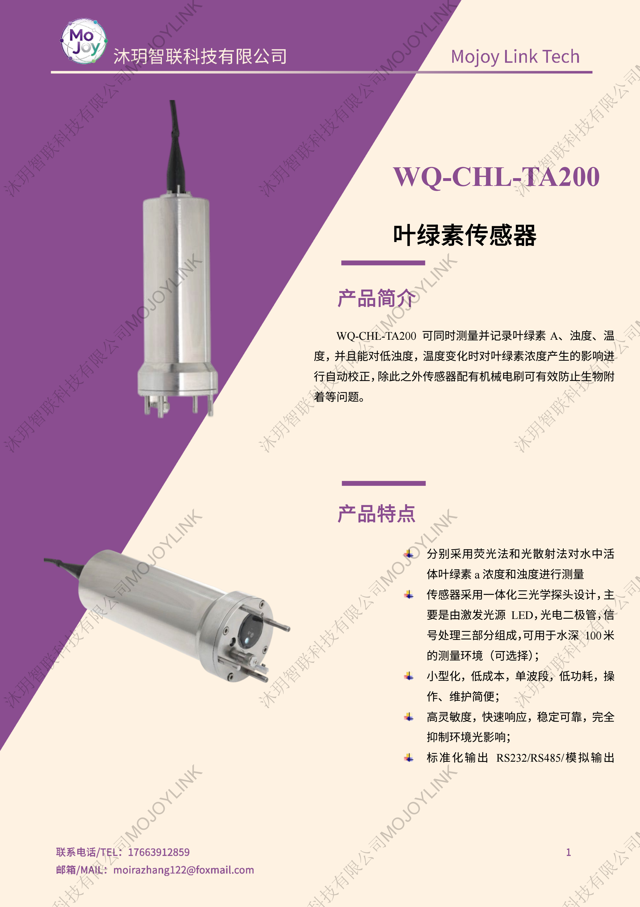
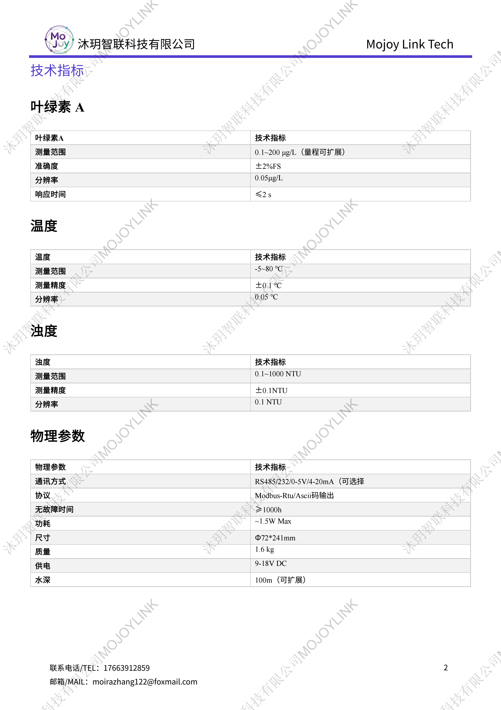

+++
title = "WQ-CHL-TA200 叶绿素浊度温度三合一水质传感器"
description = "WQ-CHL-TA200 一体化叶绿素传感器同步测叶绿素 A、浊度、水温，自带自动补偿与自清洁电刷，100 米水深可用，Modbus 协议，河湖水库蓝藻水华在线监测专用探头。"
summary = "WQ-CHL-TA200 三参数水质探头采用荧光法测叶绿素，内置机械刷防生物附着，自动校正浊度、温度干扰，低功耗，支持 RS485/4-20mA，适用于水体富营养化长期监测。"
date = "2026-06-26T22:06:36+08:00"
draft = false
tags = [ "水质与生态观测" ]
keywords = [
  "WQ-CHL-TA200",
  "叶绿素传感器",
  "三合一水质探头",
  "水体叶绿素 a 检测仪",
  "浊度温度水质探头",
  "水下自清洁水质传感器"
]
+++

## 产品简介
WQ-CHL-TA200 是一体化三参数水质传感器，集成叶绿素 A、浊度、温度同步检测功能，搭载自动温度浊度补偿算法与机械自清洁电刷，可长期水下作业减少生物附着干扰；设备小型低功耗，支持多信号输出，适配河湖、水库、近海等水域富营养化、蓝藻水华常态化在线观测。

## 规格参数

## 适用场景
1. 湖泊、水库饮用水源地蓝藻水华预警监测
2. 城市内河、河道水体富营养化常态化在线监测
3. 近海海湾、养殖海域藻类生态连续观测
4. 湿地、塘渠水环境生态长期采样监测
5. 浮标式水质监测站配套水下传感单元
6. 水利水文站点水体叶绿素野外定点监测
7. 高校、科研院所水环境藻类实验观测
8. 排污口、景观湖水质污染动态监测

