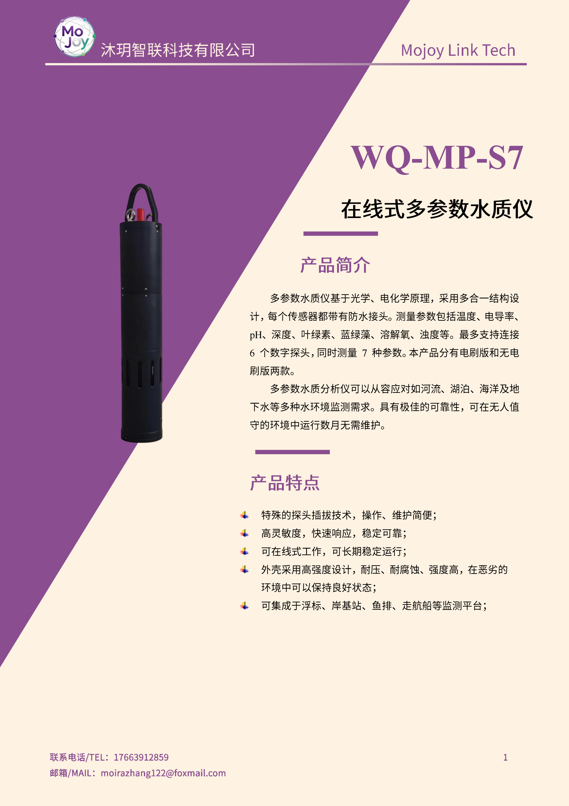
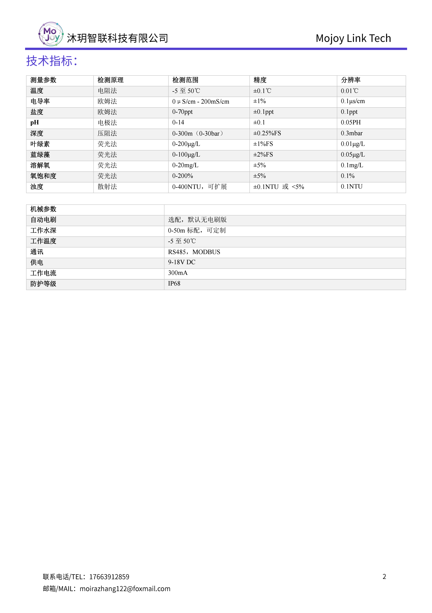

+++
title = "WQ-MP-S7 在线式多参数水质仪"
description = "WQ-MP-S7 多参数水质仪可同步检测温度、pH、溶解氧、叶绿素、蓝绿藻、浊度、水深，IP68 耐压防腐，可选自清洁电刷，适配浮标、走航船、河湖海水长期在线监测。"
summary = "WQ-MP-S7 一体式多参数水质探头支持 7 项水体指标同步测量，插拔式探头易维护，带自动清洁选配，兼容浮标、岸基、船舶搭载，适合各类水域长期无人值守监测"
date = "2026-06-30T21:38:39+08:00"
draft = false
tags = [ "水质与生态观测", "多参数水质监测" ]
keywords = [
  "WQ-MP-S7",
  "多参数水质仪",
  "七合一水质传感器",
  "浮标水质监测设备",
  "蓝绿藻叶绿素检测仪",
  "IP68 在线水质分析仪"
]
+++

## 产品简介
WQ-MP-S7 在线式多参数水质仪为模块化一体化水下监测设备，最多同步采集 7 项水环境核心指标，采用可插拔独立数字探头设计，维护更换便捷；整机 IP68 耐压耐腐蚀，分带自清洁电刷与标准版两种配置，可长期部署于各类淡水、海水环境，适配浮标、岸基站、渔业平台、走航船舶多种监测载体，数月免维护稳定运行。

## 规格参数

## 适用场景
1. 河流、湖泊、水库、饮用水源地常态化水质在线监测
2. 近海、海湾、海水养殖区生态藻类同步观测
3. 水上浮标、岸基固定水质监测站核心传感单元
4. 渔业鱼排、水产养殖塘水环境实时管控
5. 地下水、湿地、景观湖富营养化长期监测
6. 环保、水利部门流域水质定点普查
7. 高校水环境科研野外长期定点实验

