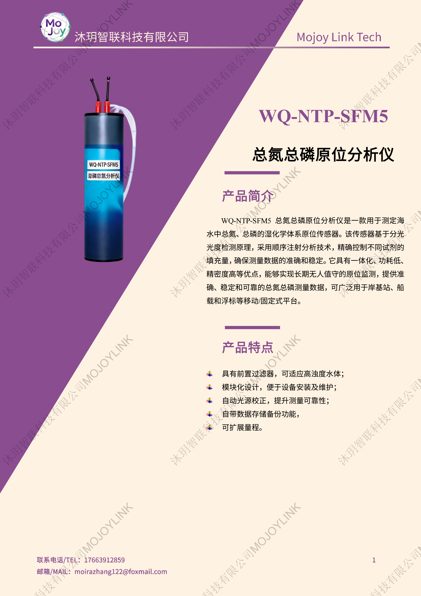
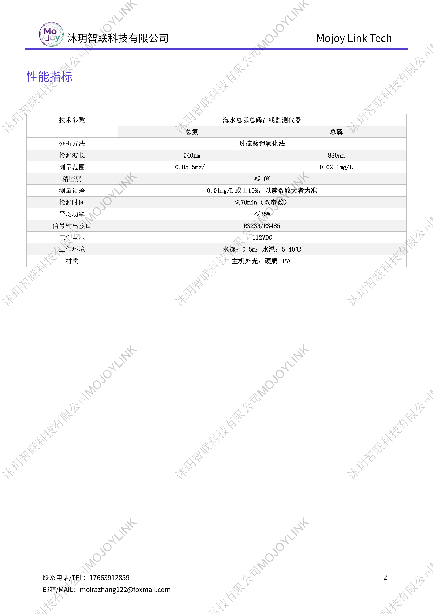

+++
title = "WQ-NTP-SFM5 总氮总磷原位分析仪"
description = "WQ-NTP-SFM5 原位总氮总磷分析仪采用顺序注射分光光度法，适配海水高浊水体，自动光源校正，模块化低功耗，支持浮标、船载、岸基长期无人值守氮磷在线监测。"
summary = "WQ-NTP-SFM5 湿化学型总氮总磷原位传感器，带前置过滤适配高浊海水，可自动存储数据、量程拓展，RS485 标准输出，适合海洋水环境氮磷污染长期原位观测。"
date = "2026-06-30T21:38:39+08:00"
draft = false
tags = [ "水质与生态观测" ]
keywords = [
  "WQ-NTP-SFM5",
  "总氮总磷原位分析仪",
  "海水氮磷在线传感器",
  "湿化学水质监测设备",
  "海洋富营养化检测仪",
  "浮标总磷总氮分析仪"
]
+++

## 产品简介
WQ-NTP-SFM5 总氮总磷原位分析仪是面向海水环境的湿化学式在线监测设备，依托顺序注射分光光度法、过硫酸钾氧化法精准检测水体总氮、总磷；设备配备前置过滤器适配高浊水域，具备自动光源校准、本地数据存储、量程拓展能力，模块化结构方便运维，低功耗设计可搭载浮标、船舶、岸基站实现长期无人值守原位监测。

## 规格参数

## 适用场景
1. 近海、海湾、海水养殖海域氮磷富营养化长期监测
2. 海洋浮标、离岸监测平台原位总氮总磷在线采集
3. 海岸带固定岸基监测站常态化水质分析
4. 河口咸淡水交界区域营养盐污染溯源监测
5. 海洋环保、水利部门海水富营养化预警项目

