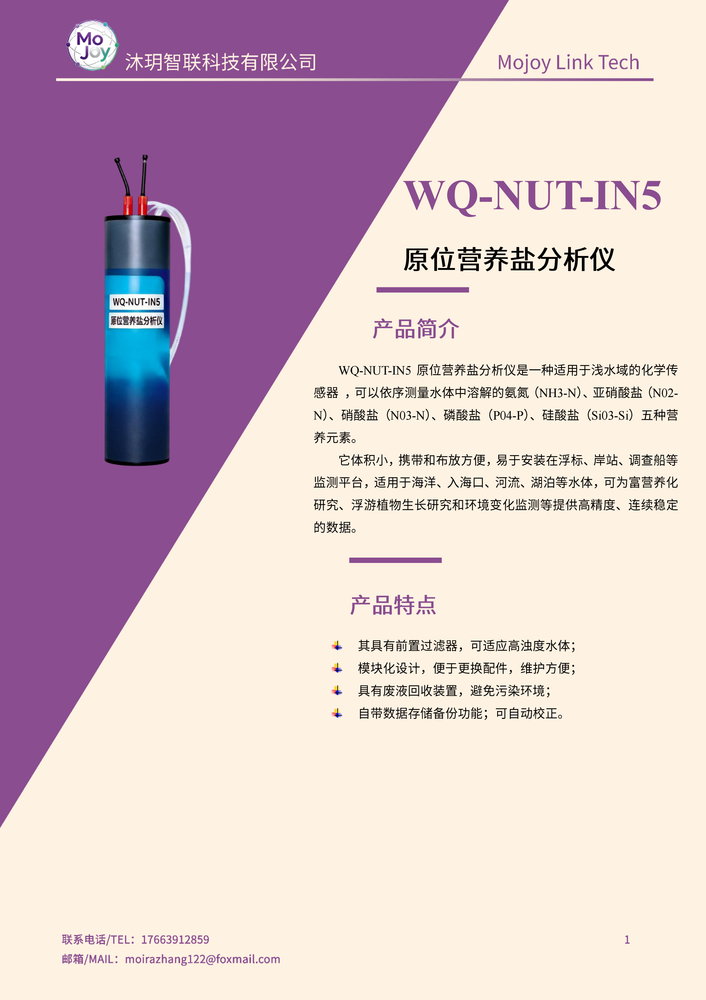
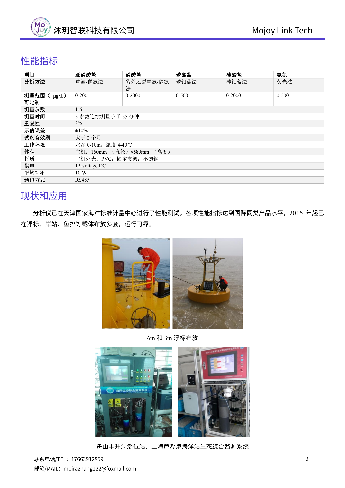

+++
title = "WQ-NUT-IN5 五参数原位营养盐分析仪"
description = "WQ-NUT-IN5 原位营养盐分析仪可同步检测氨氮、亚硝氮、硝氮、磷酸盐、硅酸盐，配备前置过滤与废液回收，模块化易维护，适配浮标、岸站、走航船浅水域富营养化监测。"
summary = "WQ-NUT-IN5 五参数营养盐传感器采用标准化学检测法，可连续测量五类水体营养盐，自带防浊过滤与废液收集装置，体积小巧，适合河湖、近海、河口长期原位连续监测。"
date = "2026-06-30T21:38:39+08:00"
draft = false
tags = [ "水质与生态观测" ]
keywords = [
  "WQ-NUT-IN5",
  "原位营养盐分析仪",
  "五参数水质营养盐传感器",
  "氨氮磷酸盐硅酸盐检测仪",
  "海水富营养化监测设备",
  "浮标搭载营养盐分析仪"
]
+++

## 产品简介
WQ-NUT-IN5 原位营养盐分析仪是浅水域专用多参数化学水质监测设备，可依次完成氨氮、亚硝酸盐氮、硝酸盐氮、磷酸盐、硅酸盐五类营养盐高精度连续检测；设备搭载前置过滤器适配高浊水体，配套废液回收装置避免二次污染，整体小型模块化设计，配件更换、现场维护便捷，可安装于浮标、岸基、调查船等载体，为水体富营养化、浮游生态研究提供长期稳定连续监测数据。

## 规格参数

## 适用场景
1. 近海海湾、海洋浮标长期营养盐原位自动监测
2. 江河入海口、咸淡水交界断面营养盐溯源检测
3. 湖泊、水库、河道富营养化常态化在线监测
4. 海岸海洋站、潮位站生态综合监测系统配套
5. 海洋环保、水利部门流域水质污染监测项目

